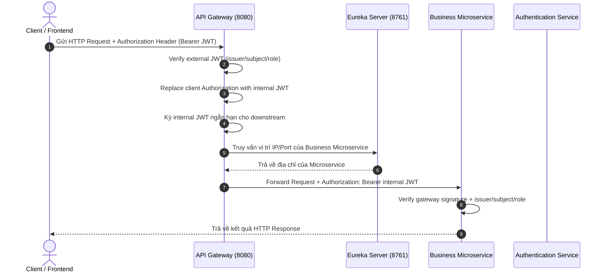

# 🚀 IELTSPath

IELTSPath là backend microservices xây dựng trên hệ sinh thái **Java 21** và **Spring Cloud**. Dự án tích hợp hạ tầng lõi gồm Gateway, Service Discovery, Config Server và module bảo mật dùng chung.

---

## 🛠️ Công Nghệ Sử Dụng (Tech Stack)

| Thành phần | Công nghệ / Thư viện | Phiên bản | Chức năng chính |
| :--- | :--- | :--- | :--- |
| **Language** | Java | **OpenJDK 21** | Ngôn ngữ lập trình cốt lõi |
| **Framework** | Spring Boot | **3.5.14** | Framework ứng dụng nền tảng |
| **Cloud Ecosystem** | Spring Cloud | **2025.0.0** | Hệ sinh thái dịch vụ đám mây |
| **API Gateway** | Spring Cloud Gateway (WebFlux Reactive) | 2025.0.0 | Quản lý định tuyến API, xác thực & phân quyền tập trung dựa trên kiến trúc Phản ứng (Reactive, Non-blocking Netty Engine) |
| **Service Discovery** | Spring Cloud Netflix Eureka | 2025.0.0 | Đăng ký và phát hiện dịch vụ tự động |
| **Config Management**| Spring Cloud Config Server | 2025.0.0 | Quản lý cấu hình tập trung cho toàn bộ microservices |
| **Security & Auth** | Spring Security & OAuth2 (Reactive) | 3.5.14 | Xử lý token JWT và Context người dùng bất đồng bộ |
| **Shared Common** | Custom `common-security` | 1.0-SNAPSHOT | Module dùng chung: `CanonicalRoles`, `InternalJwtClaims`, `InternalJwtAuthorities`, `InternalJwtValidators` |
| **Database** | PostgreSQL | 15-alpine | Hệ quản trị cơ sở dữ liệu quan hệ |
| **Containerization** | Docker & Docker Compose | Latest | Đóng gói và chạy môi trường hạ tầng nhanh chóng |
| **Build Tool** | Maven (Multi-module) | 3.9+ | Quản lý dependencies và đóng gói dự án |

---

## 📁 Cấu Trúc Dự Án (Project Architecture)

Dự án được thiết kế theo mô hình **Maven Multi-module**:

```text
IELTSPath/
├── infra/                      # Chứa các dịch vụ hạ tầng Spring Cloud
│   ├── api-gateway/            # [Port 8080] API Gateway (WebFlux Reactive Netty), kiểm tra JWT & định tuyến
│   ├── config-server/          # [Port 8888] Centralized Config Server
│   └── eureka-server/          # [Port 8761] Eureka Service Discovery Registry Server
├── shared/                     # Chứa các module dùng chung giữa các microservices
│   └── common-security/        # CanonicalRoles, InternalJwtClaims, InternalJwtAuthorities, InternalJwtValidators
├── services/                   # Chứa các microservice nghiệp vụ
├── docker-compose.yml          # File Docker Compose khởi chạy hạ tầng (Postgres, Infrastructure)
├── pom.xml                     # Root POM quản lý phiên bản và danh sách module
└── README.md                   # Tài liệu hướng dẫn dự án
```

---

## 🔄 Cách Thức Hoạt Động (How It Works)

### 1. Luồng Xử Lý Request (Request Lifecycle)



### 2. Cơ Chế Bảo Mật

Client xác thực bằng access token. API Gateway kiểm tra token này trước khi định tuyến,
sau đó thay nó bằng một internal JWT ngắn hạn để gửi đến service đích. Các downstream
service xác thực internal JWT bằng `common-security` và chỉ dùng identity đã được xác
thực; không tin cậy các header danh tính do client tự gửi. Secret cho external và
internal token được tách riêng, còn role được quản lý tập trung.

### 3. Kiến Trúc Reactive (Reactive Programming Model) Tại API Gateway

Dịch vụ **API Gateway** (`infra/api-gateway`) được xây dựng 100% dựa trên mô hình **Lập trình Phản ứng (Reactive Programming)**:
- **Framework**: Sử dụng `spring-cloud-starter-gateway-server-webflux` chạy trên engine non-blocking **Netty** giúp xử lý hàng nghìn kết nối đồng thời với lượng tài nguyên CPU/RAM tối thiểu.
- **Reactive Security**: Phân quyền & giải mã Token JWT bất đồng bộ thông qua `ServerHttpSecurity`, `SecurityWebFilterChain` và `NimbusReactiveJwtDecoder`.
- **Reactive Filters**: Tất cả bộ lọc (`CorrelationIdFilter`, `LoggingFilter`) đều thực thi non-blocking thông qua `Mono<Void>` và `ServerWebExchange`.
- **Shared Security Constants**: `SecurityConfig` và `InternalJwtService` dùng constants tập trung từ `common-security` — `CanonicalRoles.ALL`, `InternalJwtClaims.ROLES`, `InternalJwtAuthorities` — thay vì hardcode string literal.

---

## 🚀 Hướng Dẫn Chạy Dự Án Cho Lập Trình Viên (Getting Started)

### 1. Yêu Cầu Môi Trường (Prerequisites)
- **Java Development Kit (JDK)**: Version 21.
- **Maven**: Version 3.9+.
- **Docker & Docker Desktop**: Để chạy ứng dụng hạ tầng và Cơ sở dữ liệu.

### 2. Cài Graphify Cho Người Lần Đầu
Graphify giúp tạo knowledge graph từ source code để đọc kiến trúc, quan hệ file,
class, dependency và luồng gọi nhanh hơn. Package trên PyPI tên là `graphifyy`
nhưng command sau khi cài là `graphify`.

Kiểm tra máy đã có `uv` chưa:

```powershell
uv --version
```

Nếu chưa có `uv`, cài bằng PowerShell:

```powershell
powershell -ExecutionPolicy ByPass -c "irm https://astral.sh/uv/install.ps1 | iex"
```

Sau khi cài, đóng terminal rồi mở lại. Nếu command vẫn chưa nhận, chạy:

```powershell
uv tool update-shell
```

Cài Graphify bằng `uv`:

```powershell
uv tool install graphifyy
graphify --version
```

Đăng ký Graphify skill cho project hiện tại:

```powershell
graphify install --project
```

Tạo graph cho repo:

```powershell
graphify .
```

Kết quả sẽ nằm trong `graphify-out/`, gồm graph JSON, báo cáo và trang HTML
tương tác. Repo đã có `.graphifyignore` để bỏ qua artifact Graphify và markdown
khi build graph.

### 3. Biên Dịch Dự Án (Build Codebase)
Mở terminal tại thư mục gốc của dự án và chạy:
```bash
mvn clean compile -DskipTests
```
*(Nếu hiển thị `BUILD SUCCESS` là toàn bộ cấu trúc dự án và các module con đã hợp lệ).*

### 4. Khởi Chạy Hạ Tầng Với Docker
Trước khi chạy, đảm bảo Docker Desktop đang bật và file `.env` ở root có đủ
các biến bắt buộc:

```env
POSTGRES_PASSWORD=<set-a-local-password>
EXTERNAL_JWT_SECRET=<base64-32-bytes>
GATEWAY_INTERNAL_JWT_SECRET=<base64-32-bytes>
```

Build và chạy toàn bộ hệ thống:

```bash
docker compose up -d --build
```

Các URL/port sau khi chạy:

- **API Gateway**: `http://localhost:8080`
- **Eureka Server Dashboard**: `http://localhost:8761`
- **Config Server**: `http://localhost:8888`
- **PostgreSQL Database**: `localhost:5432`

### 5. Quản Lý Schema Bằng Flyway

Với service sử dụng Flyway, migration tự chạy khi service khởi động. Khi thay đổi schema:

1. Thêm file SQL vào `services/<service-name>/src/main/resources/db/migration/`.
2. Đặt tên theo mẫu `V<version>__<short_description>.sql`: version tăng dần, mô tả viết thường và dùng dấu gạch dưới; ví dụ `V1__create_initial_schema.sql`.
3. Không sửa migration đã được áp dụng; tạo migration mới với version tiếp theo cho mọi thay đổi schema.

## 🌿 Quy Chuẩn Đặt Tên Nhánh (Branch Naming Convention)

Để team làm việc thống nhất và dễ review code, nên đặt tên nhánh theo quy tắc sau:

### 1. Nguyên tắc chung

- Dùng chữ thường, không dấu
- Dùng kiểu `kebab-case`
- Bắt đầu bằng prefix mô tả mục đích
- Nếu có ticket/issue, nên thêm ID vào tên nhánh
- Không đặt tên quá dài, ưu tiên ngắn gọn nhưng rõ ý nghĩa

### 2. Prefix khuyến nghị

- `feature/` — thêm tính năng mới
- `fix/` — sửa bug
- `hotfix/` — sửa lỗi gấp trên môi trường production
- `refactor/` — cải tổ code mà không đổi behavior
- `chore/` — setup, config, cleanup, maintenance
- `docs/` — cập nhật tài liệu
- `test/` — thêm hoặc sửa test
- `perf/` — tối ưu hiệu năng
- `release/` — chuẩn bị bản phát hành

### 3. Template đề xuất

```text
<type>/<module>-<short-description>
<type>/<issue-id>-<short-description>
```
