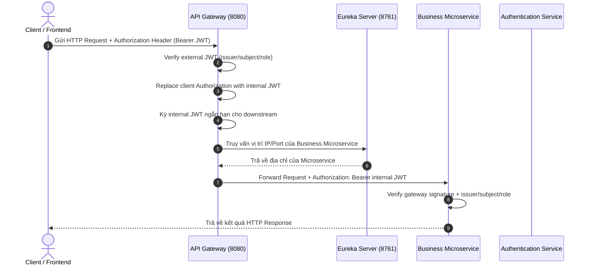

# 🚀 IELTSPath

IELTSPath là backend microservices gồm các dịch vụ **Java 21 / Spring Cloud** và dịch vụ **Python / FastAPI**. Hệ thống tích hợp Gateway, Service Discovery, Config Server và module bảo mật dùng chung.

---

## 🛠️ Công Nghệ Sử Dụng (Tech Stack)

| Thành phần                | Công nghệ / Thư viện                | Phiên bản          | Chức năng chính                                                                                                                        |
| :-------------------------- | :-------------------------------------- | :------------------- | :---------------------------------------------------------------------------------------------------------------------------------------- |
| **Language**          | Java, Python                            | **OpenJDK 21, Python 3.11+** | Ngôn ngữ triển khai các microservice                                                                                              |
| **Framework**         | Spring Boot                             | **3.5.14**     | Framework ứng dụng nền tảng                                                                                                           |
| **Cloud Ecosystem**   | Spring Cloud                            | **2025.0.0**   | Hệ sinh thái dịch vụ đám mây                                                                                                       |
| **API Gateway**       | Spring Cloud Gateway (WebFlux Reactive) | 2025.0.0             | Quản lý định tuyến API, xác thực & phân quyền tập trung dựa trên kiến trúc Phản ứng (Reactive, Non-blocking Netty Engine) |
| **AI Learning API**  | FastAPI, DeepTutor                      | Python 3.11+         | Adaptive Learning và DeepTutor Mastery Path                              |
| **Service Discovery** | Spring Cloud Netflix Eureka             | 2025.0.0             | Đăng ký và phát hiện dịch vụ tự động                                                                                           |
| **Config Management** | Spring Cloud Config Server              | 2025.0.0             | Quản lý cấu hình tập trung cho toàn bộ microservices                                                                               |
| **Security & Auth**   | Spring Security & OAuth2 (Reactive)     | 3.5.14               | Xử lý token JWT và Context người dùng bất đồng bộ                                                                               |
| **Shared Common**     | Custom`common-security`               | 1.0-SNAPSHOT         | Module dùng chung:`CanonicalRoles`, `InternalJwtClaims`, `InternalJwtAuthorities`, `InternalJwtValidators`                       |
| **Database**          | PostgreSQL                              | 15-alpine            | Hệ quản trị cơ sở dữ liệu quan hệ                                                                                                 |
| **Containerization**  | Docker & Docker Compose                 | Latest               | Đóng gói và chạy môi trường hạ tầng nhanh chóng                                                                                |
| **Build Tool**        | Maven, pip                               | Maven 3.9+, pip       | Maven cho Java services; pip requirements và Dockerfile riêng cho AI Learning                                                   |

---

## 📁 Cấu Trúc Dự Án (Project Architecture)

Dịch vụ Java dùng **Maven Multi-module**; `ai-learning-service` là Python/FastAPI service riêng.

```text
IELTSPath/
├── infra/                      # Chứa các dịch vụ hạ tầng Spring Cloud
│   ├── api-gateway/            # [Port 8080] API Gateway (WebFlux Reactive Netty), kiểm tra JWT & định tuyến
│   ├── config-server/          # [Port 8888] Centralized Config Server
│   └── eureka-server/          # [Port 8761] Eureka Service Discovery Registry Server
├── shared/                     # Chứa các module dùng chung giữa các microservices
│   └── common-security/        # CanonicalRoles, InternalJwtClaims, InternalJwtAuthorities, InternalJwtValidators
├── services/                   # Chứa các microservice nghiệp vụ
│   ├── ai-learning-service/    # [Port 8000] FastAPI + DeepTutor, build bằng Dockerfile riêng
│   ├── user-service/           # User identity, roles, auth và learning goals
│   └── learning-support-service/ # Learner-owned utility state
├── services/community-service  # Bài viết, bình luận, reaction và moderation
├── docker-compose.yml          # File Docker Compose khởi chạy hạ tầng (Postgres, Infrastructure)
├── pom.xml                     # Root POM quản lý phiên bản và danh sách module
└── README.md                   # Tài liệu hướng dẫn dự án
```

---

## 🔄 Cách Thức Hoạt Động (How It Works)

### 1. Luồng Xử Lý Request (Request Lifecycle)



### 2. Cơ Chế Bảo Mật

Client xác thực bằng access token. API Gateway kiểm tra token này trước khi định tuyến,
sau đó thay nó bằng một internal JWT ngắn hạn để gửi đến service đích. Các downstream
service xác thực internal JWT bằng `common-security` và chỉ dùng identity đã được xác
thực; không tin cậy các header danh tính do client tự gửi. Secret cho external và
internal token được tách riêng, còn role được quản lý tập trung.

### 3. Kiến Trúc Reactive (Reactive Programming Model) Tại API Gateway

Dịch vụ **API Gateway** (`infra/api-gateway`) được xây dựng 100% dựa trên mô hình **Lập trình Phản ứng (Reactive Programming)**:

- **Framework**: Sử dụng `spring-cloud-starter-gateway-server-webflux` chạy trên engine non-blocking **Netty** giúp xử lý hàng nghìn kết nối đồng thời với lượng tài nguyên CPU/RAM tối thiểu.
- **Reactive Security**: Phân quyền & giải mã Token JWT bất đồng bộ thông qua `ServerHttpSecurity`, `SecurityWebFilterChain` và `NimbusReactiveJwtDecoder`.
- **Reactive Filters**: Tất cả bộ lọc (`CorrelationIdFilter`, `LoggingFilter`) đều thực thi non-blocking thông qua `Mono<Void>` và `ServerWebExchange`.
- **Shared Security Constants**: `SecurityConfig` và `InternalJwtService` dùng constants tập trung từ `common-security` — `CanonicalRoles.ALL`, `InternalJwtClaims.ROLES`, `InternalJwtAuthorities` — thay vì hardcode string literal.

---

## 🚀 Hướng Dẫn Chạy Dự Án Cho Lập Trình Viên (Getting Started)

### 1. Yêu Cầu Môi Trường (Prerequisites)

- **Java Development Kit (JDK)**: Version 21.
- **Python**: Version 3.11+ để chạy hoặc build `ai-learning-service`.
- **Maven**: Version 3.9+.
- **Docker & Docker Desktop**: Để chạy ứng dụng hạ tầng và Cơ sở dữ liệu.

### 2. Cài Graphify Cho Người Lần Đầu

Graphify giúp tạo knowledge graph từ source code để đọc kiến trúc, quan hệ file,
class, dependency và luồng gọi nhanh hơn. Package trên PyPI tên là `graphifyy`
nhưng command sau khi cài là `graphify`.

Kiểm tra máy đã có `uv` chưa:

```powershell
uv --version
```

Nếu chưa có `uv`, cài bằng PowerShell:

```powershell
powershell -ExecutionPolicy ByPass -c "irm https://astral.sh/uv/install.ps1 | iex"
```

Sau khi cài, đóng terminal rồi mở lại. Nếu command vẫn chưa nhận, chạy:

```powershell
uv tool update-shell
```

Cài Graphify bằng `uv`:

```powershell
uv tool install graphifyy
graphify --version
```

Đăng ký Graphify skill cho Codex trong project hiện tại (tuỳ chọn):

```powershell
graphify install --platform codex
```

Tạo knowledge graph từ source code. Chế độ `--code-only` không cần API key hoặc LLM:

```powershell
graphify extract . --code-only
```

Tạo trang đồ thị tương tác từ graph đã sinh:

```powershell
graphify export html --graph .\graphify-out\graph.json
```

Cập nhật đồ thị sau khi code thay đổi (Incremental Update):

Sau khi thêm mới hoặc sửa đổi code, chạy lệnh cập nhật gia tăng để cập nhật graph nhanh chóng mà không cần extract lại toàn bộ từ đầu:

```powershell
graphify update .
```

Nếu vừa refactor lớn hoặc xóa nhiều file, dùng cờ `--force`:

```powershell
graphify update . --force
```

Sau khi update, chạy lại lệnh xuất HTML để đồng bộ giao diện hiển thị:

```powershell
graphify export html --graph .\graphify-out\graph.json
```

Truy vấn và phân tích quan hệ codebase qua CLI:

```powershell
graphify query "<câu hỏi về codebase>"
graphify explain "<khái niệm hoặc symbol>"
graphify path "<symbol A>" "<symbol B>"
graphify affected "<symbol thay đổi>"
```

Kết quả nằm trong `graphify-out/`:

- `graph.json`: knowledge graph dùng với các lệnh như `graphify query`, `graphify path` và `graphify explain`.
- `graph.html`: trang đồ thị tương tác, có thể mở trực tiếp bằng trình duyệt.
- `cache/`: cache nội bộ; `cache/stat-index.json` không phải graph hoàn chỉnh.

Nếu đã cấu hình API key/backend LLM, có thể bỏ `--code-only` để Graphify bổ sung các quan hệ semantic. Repo đã có `.graphifyignore` để bỏ qua artifact Graphify và markdown khi build graph.

### 3. Biên Dịch Dự Án (Build Codebase)

Mở terminal tại thư mục gốc của dự án và chạy:

```bash
mvn clean compile -DskipTests
```

*(Nếu hiển thị `BUILD SUCCESS` là toàn bộ cấu trúc dự án và các module con đã hợp lệ).*

### 4. Khởi Chạy Hạ Tầng Với Docker

Trước khi chạy, đảm bảo Docker Desktop đang bật và file `.env` ở root có đủ
các biến bắt buộc:

```env
POSTGRES_PASSWORD=<set-a-local-password>
EXTERNAL_JWT_SECRET=<base64-32-bytes>
GATEWAY_INTERNAL_JWT_SECRET=<base64-32-bytes>
```

Build và chạy toàn bộ hệ thống:

```bash
docker compose up -d --build
```

Các URL/port sau khi chạy:

- **API Gateway**: `http://localhost:8080`
- **Eureka Server Dashboard**: `http://localhost:8761`
- **Config Server**: `http://localhost:8888`
- **User PostgreSQL Database**: `localhost:5432`
- **Community PostgreSQL Database**: `localhost:5433`
- **Community API (qua Gateway)**: `http://localhost:8080/api/community/**`

### 5. Quản Lý Schema Bằng Flyway

Với service sử dụng Flyway, migration tự chạy khi service khởi động. Khi thay đổi schema:

1. Thêm file SQL vào `services/<service-name>/src/main/resources/db/migration/`.
2. Đặt tên theo mẫu `V<version>__<short_description>.sql`: version tăng dần, mô tả viết thường và dùng dấu gạch dưới; ví dụ `V1__create_initial_schema.sql`.
3. Không sửa migration đã được áp dụng; tạo migration mới với version tiếp theo cho mọi thay đổi schema.

### 6. Chạy Luồng Chính Local (Assessment → AI Learning)

Luồng: learner làm bài → grader finalize → outbox → RabbitMQ → consumer → DeepTutor → `GET /api/ai-learning/status`.
Phần AI Learning chạy bằng compose; các service Java chạy trên host (IDE hoặc `java -jar`).

**Biến môi trường** (đặt trong `.env` ở root, file này đã được gitignore; không commit giá trị):

| Biến | Dùng cho |
| --- | --- |
| `POSTGRES_PASSWORD`, `GAME_DB_PASSWORD` | Compose nội suy toàn bộ file, nên phải có dù không chạy các DB đó |
| `AI_LEARNING_DB_PASSWORD` | `ai-learning-db`, Flyway migrate, API và consumer |
| `RABBITMQ_USERNAME`, `RABBITMQ_PASSWORD` | Broker trong compose. Assessment trên host phải dùng đúng cặp này (mặc định `guest` sẽ fail) |
| `GATEWAY_INTERNAL_JWT_SECRET` | Gateway và toàn bộ downstream service phải dùng cùng giá trị, lệch sẽ trả 401 |
| `EXTERNAL_JWT_SECRET` | User Service ký token, Gateway xác thực |

Nếu mật khẩu có ký tự đặc biệt, hãy percent-encode hoặc chọn giá trị an toàn cho URL, vì nó nằm trong URL DB/AMQP.

**Thứ tự khởi động:**

1. PostgreSQL local (`localhost:5432`) có sẵn `user_db`, `content_db`, `assessment_db`. Flyway của từng service tự áp khi khởi động.
2. AI Learning và RabbitMQ:
   ```bash
   docker compose up -d --build rabbitmq ai-learning-db ai-learning-migrate ai-learning-api ai-learning-consumer
   ```
   `ai-learning-migrate` chạy Flyway một lần (`0.1 → 1 → 2 → 3`) rồi thoát với exit 0; API (`127.0.0.1:8000`) và consumer chờ bước này xong.
   Consumer tự khai báo queue chính, retry, DLQ và binding `assessment.completed.v2`.
3. Service Java trên host: config-server → eureka → api-gateway → user → content → assessment. Các Spring module tự nạp `.env` ở root repository (khi working directory là root hoặc thư mục module), nên không cần khai báo secret khác nhau ở từng Run Configuration.

Container AI Learning gọi User (`8085`) và Content (`8082`) trên host qua `host.docker.internal`, và chuyển tiếp thẳng internal JWT của learner. Trên Windows, firewall có thể chặn đường này: cho Java đi qua firewall (mạng private), hoặc chạy API bằng `uvicorn` trên host.

**Sắp xếp path bằng Gemini (tùy chọn):**

AI Learning gọi Gemini qua lớp LLM của DeepTutor khi tạo path cho goal mới. Cấu hình
nằm ở `services/ai-learning-service/deeptutor-data/user/settings/model_catalog.json`,
được git-ignore và chỉ gắn vào container API. Tạo file này từ
`services/ai-learning-service/model_catalog.example.json` nếu chưa có catalog;
không ghi đè catalog hiện có. Điền key/model trong file riêng này, giữ `base_url`
trống, rồi chạy:

```powershell
docker compose restart ai-learning-api
docker compose exec -u appuser ai-learning-api deeptutor config show
```

Luôn chạy lệnh DeepTutor trong container bằng `-u appuser`. `docker compose exec`
mặc định chạy bằng root. Khi đó DeepTutor ghi lại catalog thành file của root với quyền
`0600`, API (uid 10001) không đọc được, nên coi catalog là rỗng và ghi đè nó: key và
model mất khỏi file, path báo `llm_not_configured`. Nếu đã lỡ chạy bằng root, xóa
catalog, tạo lại, rồi restart `ai-learning-api`.

Kiểm tra `llm.provider` là `gemini`, model đúng cấu hình và `llm.api_key` hiển thị
`***`. Không cấu hình hoặc LLM lỗi thì vẫn tạo path theo thứ tự Content. Thứ tự đã
lưu được giữ nguyên khi nhận kết quả thi hoặc refresh; KP mới được thêm cuối module.
Xem [LLM path ordering](services/ai-learning-service/README.md#llm-path-ordering)
để biết dữ liệu gửi ra ngoài, cách cấu hình không ghi đè file, tắt tính năng, bảng
lý do fallback và năm kịch bản E2E bằng stub không cần key thật.

**Chạy test Python AI Learning:**

Từ thư mục gốc, dùng virtual environment Python của dự án:

```powershell
Set-Location services/ai-learning-service
python -m pip install pytest -r requirements-test.txt
$env:PYTHONPATH = "../../third_party/deeptutor;."
$env:PYTHONDONTWRITEBYTECODE = "1"
python -m pytest tests
Set-Location ../..
```

Đặt `AI_LEARNING_TEST_DATABASE_URL` và `AI_LEARNING_TEST_AMQP_URL` tới PostgreSQL
và RabbitMQ local dành cho test để chạy đủ integration suite; thiếu chúng thì các
case tương ứng bị skip. Test LLM dùng catalog tạm và server giả, không gọi Gemini.

**Tài khoản có quyền (chỉ dev, chỉ trên DB local):**

1. Đăng ký tài khoản qua `POST /api/users/register`. Mọi tài khoản mới đều nhận role `CUSTOMER`.
2. Hệ thống không seed ADMIN. Gán ADMIN cho tài khoản đầu tiên bằng SQL trên `user_db` local:
   ```sql
   INSERT INTO user_roles (user_id, role_id)
   SELECT u.id, r.id FROM users u JOIN roles r ON r.name = 'ADMIN'
   WHERE u.email = '<email của admin>'
   ON CONFLICT DO NOTHING;
   ```
   > ⚠️ Không bao giờ chạy lệnh này trên database dùng chung hoặc production.
3. Admin đăng nhập lại (`POST /auth/login`) để token mang role mới, rồi cấp role khác (ví dụ `EXAMINER`) qua `PUT /api/users/{id}/roles`. Người được cấp cũng phải đăng nhập lại.

Grader (`EXAMINER`/`ADMIN`) chấm qua `/api/assessments/grading/**`, xem `services/assessment-service/README.md`.
Bằng chứng E2E của lần kiểm chứng gần nhất nằm trong `plans/260924-2135-main-flow-blockers/reports/`.

## 🌿 Quy Chuẩn Đặt Tên Nhánh (Branch Naming Convention)

Để team làm việc thống nhất và dễ review code, nên đặt tên nhánh theo quy tắc sau:

### 1. Nguyên tắc chung

- Dùng chữ thường, không dấu
- Dùng kiểu `kebab-case`
- Bắt đầu bằng prefix mô tả mục đích
- Nếu có ticket/issue, nên thêm ID vào tên nhánh
- Không đặt tên quá dài, ưu tiên ngắn gọn nhưng rõ ý nghĩa

### 2. Prefix khuyến nghị

- `feature/` — thêm tính năng mới
- `fix/` — sửa bug
- `hotfix/` — sửa lỗi gấp trên môi trường production
- `refactor/` — cải tổ code mà không đổi behavior
- `chore/` — setup, config, cleanup, maintenance
- `docs/` — cập nhật tài liệu
- `test/` — thêm hoặc sửa test
- `perf/` — tối ưu hiệu năng
- `release/` — chuẩn bị bản phát hành

### 3. Template đề xuất

```text
<type>/<module>-<short-description>
<type>/<issue-id>-<short-description>
```
