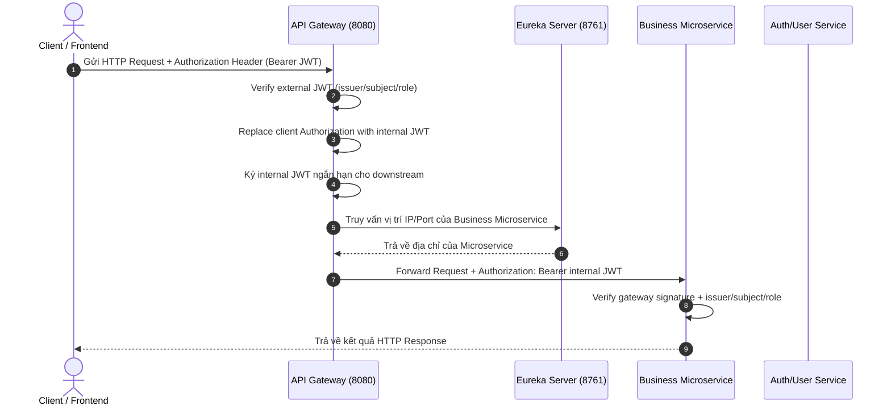

# 🚀 `code-base` — Microservices Starter Baseline Template

Bộ khung (boilerplate / starter template) chuẩn hóa kiến trúc **Microservices** xây dựng trên hệ sinh thái **Java 21** và **Spring Cloud**. Khung dự án đã được tích hợp sẵn hệ thống hạ tầng lõi (Gateway, Service Discovery, Config Server) cùng module Bảo mật (Security) dùng chung, giúp team phát triển nhanh chóng khởi tạo và mở rộng các dịch vụ nghiệp vụ mới.

---

## 🛠️ Công Nghệ Sử Dụng (Tech Stack)

| Thành phần | Công nghệ / Thư viện | Phiên bản | Chức năng chính |
| :--- | :--- | :--- | :--- |
| **Language** | Java | **OpenJDK 21** | Ngôn ngữ lập trình cốt lõi |
| **Framework** | Spring Boot | **3.5.14** | Framework ứng dụng nền tảng |
| **Cloud Ecosystem** | Spring Cloud | **2025.0.0** | Hệ sinh thái dịch vụ đám mây |
| **API Gateway** | Spring Cloud Gateway (WebFlux Reactive) | 2025.0.0 | Quản lý định tuyến API, xác thực & phân quyền tập trung dựa trên kiến trúc Phản ứng (Reactive, Non-blocking Netty Engine) |
| **Service Discovery** | Spring Cloud Netflix Eureka | 2025.0.0 | Đăng ký và phát hiện dịch vụ tự động |
| **Config Management**| Spring Cloud Config Server | 2025.0.0 | Quản lý cấu hình tập trung cho toàn bộ microservices |
| **Security & Auth** | Spring Security & OAuth2 (Reactive) | 3.5.14 | Xử lý token JWT và Context người dùng bất đồng bộ |
| **Shared Common** | Custom `common-security` | 1.0-SNAPSHOT | Module dùng chung: `CanonicalRoles`, `InternalJwtClaims`, `InternalJwtAuthorities`, `InternalJwtValidators` |
| **Database** | PostgreSQL | 15-alpine | Hệ quản trị cơ sở dữ liệu quan hệ |
| **Containerization** | Docker & Docker Compose | Latest | Đóng gói và chạy môi trường hạ tầng nhanh chóng |
| **Build Tool** | Maven (Multi-module) | 3.9+ | Quản lý dependencies và đóng gói dự án |

---

## 📁 Cấu Trúc Dự Án (Project Architecture)

Dự án được thiết kế theo mô hình **Maven Multi-module**:

```text
code-base/
├── infra/                      # Chứa các dịch vụ hạ tầng Spring Cloud
│   ├── api-gateway/            # [Port 8080] API Gateway (WebFlux Reactive Netty), kiểm tra JWT & định tuyến
│   ├── config-server/          # [Port 8888] Centralized Config Server
│   └── eureka-server/          # [Port 8761] Eureka Service Discovery Registry Server
├── shared/                     # Chứa các module dùng chung giữa các microservices
│   └── common-security/        # CanonicalRoles, InternalJwtClaims, InternalJwtAuthorities, InternalJwtValidators
├── services/                   # Thư mục dành riêng để chứa các microservices nghiệp vụ mới
│   └── user-service/           # [artifactId: user-service] Quản lý user, đăng nhập, phát hành JWT
├── docker-compose.yml          # File Docker Compose khởi chạy hạ tầng (Postgres, Infrastructure)
├── pom.xml                     # Root POM quản lý phiên bản và danh sách module
└── README.md                   # Tài liệu hướng dẫn dự án
```

---

## 🔄 Cách Thức Hoạt Động (How It Works)

### 1. Luồng Xử Lý Request (Request Lifecycle)



### 2. Cơ Chế Bảo Mật: Gateway-signed Internal JWT

Hệ thống truyền identity bằng JWT đã verify, không dùng raw identity header. Trust boundary hiện tại:

- **External access token** do auth/user-service phát hành cho client, tối giản còn
  `iss=urn:code-base:auth`, `sub=<user-id>`, `exp`, `roles`.
- **API Gateway** verify external token bằng `EXTERNAL_JWT_SECRET`, sau đó ký
  **internal JWT** rất ngắn hạn cho downstream bằng secret nội bộ riêng.
- **Downstream service** dùng `common-security`; service tự verify chữ ký gateway,
  `iss=urn:code-base:api-gateway`, `sub=<user-id>`, `exp`, `roles`.
- Gateway thay `Authorization` từ client bằng `Authorization: Bearer <internal-jwt>` trước khi forward.
- Role hợp lệ hiện chỉ gồm `ADMIN` và `LEARNER` — định nghĩa tập trung tại `CanonicalRoles.ALL` trong `common-security`.

Downstream lấy identity từ JWT đã verify:

```java
import com.group01.commonsecurity.currentuser.CurrentUserProvider;

private final CurrentUserProvider currentUserProvider;

@GetMapping("/me")
public UserResponse me() {
    UUID userId = currentUserProvider.requireUserId();
    // roles claim đã được common-security validate và convert thành ROLE_*
}
```

### 3. Kiến Trúc Reactive (Reactive Programming Model) Tại API Gateway

Dịch vụ **API Gateway** (`infra/api-gateway`) được xây dựng 100% dựa trên mô hình **Lập trình Phản ứng (Reactive Programming)**:
- **Framework**: Sử dụng `spring-cloud-starter-gateway-server-webflux` chạy trên engine non-blocking **Netty** giúp xử lý hàng nghìn kết nối đồng thời với lượng tài nguyên CPU/RAM tối thiểu.
- **Reactive Security**: Phân quyền & giải mã Token JWT bất đồng bộ thông qua `ServerHttpSecurity`, `SecurityWebFilterChain` và `NimbusReactiveJwtDecoder`.
- **Reactive Filters**: Tất cả bộ lọc (`CorrelationIdFilter`, `LoggingFilter`) đều thực thi non-blocking thông qua `Mono<Void>` và `ServerWebExchange`.
- **Shared Security Constants**: `SecurityConfig` và `InternalJwtService` dùng constants tập trung từ `common-security` — `CanonicalRoles.ALL`, `InternalJwtClaims.ROLES`, `InternalJwtAuthorities` — thay vì hardcode string literal.

---

## 🚀 Hướng Dẫn Chạy Dự Án Cho Lập Trình Viên (Getting Started)

### 1. Yêu Cầu Môi Trường (Prerequisites)
- **Java Development Kit (JDK)**: Version 21.
- **Maven**: Version 3.9+.
- **Docker & Docker Desktop**: Để chạy ứng dụng hạ tầng và Cơ sở dữ liệu.

### 2. Cài Graphify Cho Người Lần Đầu
Graphify giúp tạo knowledge graph từ source code để đọc kiến trúc, quan hệ file,
class, dependency và luồng gọi nhanh hơn. Package trên PyPI tên là `graphifyy`
nhưng command sau khi cài là `graphify`.

Kiểm tra máy đã có `uv` chưa:

```powershell
uv --version
```

Nếu chưa có `uv`, cài bằng PowerShell:

```powershell
powershell -ExecutionPolicy ByPass -c "irm https://astral.sh/uv/install.ps1 | iex"
```

Sau khi cài, đóng terminal rồi mở lại. Nếu command vẫn chưa nhận, chạy:

```powershell
uv tool update-shell
```

Cài Graphify bằng `uv`:

```powershell
uv tool install graphifyy
graphify --version
```

Đăng ký Graphify skill cho project hiện tại:

```powershell
graphify install --project
```

Tạo graph cho repo:

```powershell
graphify .
```

Kết quả sẽ nằm trong `graphify-out/`, gồm graph JSON, báo cáo và trang HTML
tương tác. Repo đã có `.graphifyignore` để bỏ qua artifact Graphify và markdown
khi build graph.

### 3. Biên Dịch Dự Án (Build Codebase)
Mở terminal tại thư mục gốc của dự án và chạy:
```bash
mvn clean compile -DskipTests
```
*(Nếu hiển thị `BUILD SUCCESS` là toàn bộ cấu trúc dự án và các module con đã hợp lệ).*

### 4. Khởi Chạy Hạ Tầng Với Docker
Trước khi chạy, đảm bảo Docker Desktop đang bật và file `.env` ở root có đủ
các biến bắt buộc:

```env
POSTGRES_PASSWORD=123456
EXTERNAL_JWT_SECRET=<base64-32-bytes>
GATEWAY_INTERNAL_JWT_SECRET=<base64-32-bytes>
```

Tạo nhanh HMAC secret bằng PowerShell nếu cần:

```powershell
$bytes = New-Object byte[] 32
[Security.Cryptography.RandomNumberGenerator]::Fill($bytes)
[Convert]::ToBase64String($bytes)
```

Build và chạy toàn bộ hệ thống:

```bash
docker compose up -d --build
```

Docker Compose builds regular Spring Boot services with `Dockerfile.spring-service`
and passes each Maven module path through `MODULE_PATH`. `config-server` keeps a
dedicated Dockerfile because it packages `config-repo` into the image.

Kiểm tra trạng thái container:

```bash
docker compose ps
```

Xem log khi cần debug:

```bash
docker compose logs -f config-server
docker compose logs -f eureka-server
docker compose logs -f api-gateway
docker compose logs -f user-service
```

Các URL/port sau khi chạy:

- **API Gateway**: `http://localhost:8080`
- **Eureka Server Dashboard**: `http://localhost:8761`
- **Config Server**: `http://localhost:8888`
- **User PostgreSQL Database**: `localhost:5432` (User: `postgres`, Password: lấy từ `POSTGRES_PASSWORD`, DB: `user_db`)

Dừng container nhưng giữ dữ liệu database:

```bash
docker compose down
```

Dừng và xóa cả volume database local:

```bash
docker compose down -v
```

Khi sửa `Dockerfile`, `docker-compose.yml`, hoặc `config-repo`, chạy lại:

```bash
docker compose up -d --build --force-recreate
```

Docker Compose yêu cầu hai HMAC secret riêng qua environment:

- `EXTERNAL_JWT_SECRET`: user-service ký external access token, gateway verify.
- `GATEWAY_INTERNAL_JWT_SECRET`: gateway ký internal JWT, user-service verify.

Secret phải là base64 của tối thiểu 32 bytes random. Không dùng lại một
`JWT_SECRET` chung cho cả external và internal token, và không commit secret vào Git.

### 5. User Service: vai trò và cơ sở dữ liệu

`user-service` hiện chỉ hỗ trợ hai vai trò: `LEARNER` và `ADMIN`. Đăng ký công khai tại `/api/users/register` luôn tạo người dùng với vai trò `LEARNER`; các vai trò khác bị từ chối. Gateway và user service chỉ chấp nhận JWT có các vai trò chuẩn hóa này.

Schema user service được khởi tạo hoàn toàn từ migration `V1__create_user_tables.sql`, bao gồm bảng `users`, `roles`, `user_roles` và `refresh_tokens`. Đây là baseline cho database mới; database đã chạy các migration user-service cũ phải được tạo lại trước khi khởi động service.

---

## ➕ Hướng Dẫn Thêm Microservice Nghiệp Vụ Mới (Add New Microservice)

Khi thành viên trong nhóm cần phát triển một dịch vụ nghiệp vụ mới (ví dụ: `product-service`, `order-service`), hãy thực hiện các bước sau:

### Bước 1: Tạo thư mục cho service mới
Tạo thư mục mới trong `services/` (ví dụ: `services/order-service`).

### Bước 2: Khai báo Module trong Root `pom.xml`
Thêm module mới vào danh sách `<modules>` trong root [pom.xml](file:///c:/Users/Admin/OneDrive/Desktop/microservice-code-base/pom.xml):
```xml
<modules>
    <module>shared/common-security</module>
    <module>infra/api-gateway</module>
    <module>infra/config-server</module>
    <module>infra/eureka-server</module>
    <module>services/user-service</module>
    <module>services/order-service</module> <!-- Thêm service mới tại đây -->
</modules>
```

### Bước 3: Đặt cấu hình `pom.xml` cho Service mới
File `pom.xml` của service mới phải có parent trỏ về `code-base`, nhúng Eureka
Client và `common-security` nếu service có protected API.
Không dùng raw identity header làm identity; service phải verify internal JWT do gateway ký.
```xml
<parent>
    <groupId>com.group01</groupId>
    <artifactId>code-base</artifactId>
    <version>1.0-SNAPSHOT</version>
    <relativePath>../../pom.xml</relativePath>
</parent>

<artifactId>order-service</artifactId>

<dependencies>
    <!-- Shared downstream internal JWT verifier -->
    <dependency>
        <groupId>com.group01</groupId>
        <artifactId>common-security</artifactId>
        <version>${project.version}</version>
    </dependency>
    <!-- Nhúng Eureka Client để tự động đăng ký với Eureka -->
    <dependency>
        <groupId>org.springframework.cloud</groupId>
        <artifactId>spring-cloud-starter-netflix-eureka-client</artifactId>
    </dependency>
</dependencies>
```

### Bước 4: Cấu hình `application.yml` cho Service mới
```yaml
server:
  port: 8081 # Chọn port phù hợp

spring:
  application:
    name: order-service # Tên service đăng ký với Gateway & Eureka

app:
  auth:
    internal-jwt-issuer: ${INTERNAL_JWT_ISSUER:urn:code-base:api-gateway}
    internal-jwt-secret: ${GATEWAY_INTERNAL_JWT_SECRET}
  security:
    public-endpoints: [] # Add public endpoints here when needed.
```

### Bước 5: Kích hoạt Service
Thêm annotation `@EnableDiscoveryClient` tại class main của Spring Boot application:
```java
@SpringBootApplication
@EnableDiscoveryClient
public class OrderServiceApplication {
    public static void main(String[] args) {
        SpringApplication.run(OrderServiceApplication.class, args);
    }
}
```

---

## 🤝 Quy Tắc Đóng Góp & Phát Triển (Contribution Guidelines)
1. **Coding Style**: Tuân thủ chuẩn Spring Boot best practices. Sử dụng Lombok để giảm boiler-plate code.
2. **Security**: Downstream không được tin raw identity header; mọi protected API phải verify internal JWT do gateway ký.
3. **Commit Message**: Đặt tên commit rõ ràng theo định dạng `feat:`, `fix:`, `refactor:`, `docs:`.
