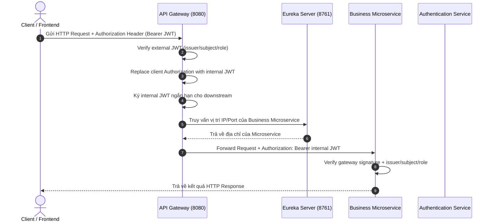

# 🚀 IELTSPath

IELTSPath là backend microservices gồm các dịch vụ **Java 21 / Spring Cloud**. Hệ thống tích hợp Gateway, Service Discovery, Config Server và module bảo mật dùng chung.

---

## 🛠️ Công Nghệ Sử Dụng (Tech Stack)

| Thành phần                | Công nghệ / Thư viện                | Phiên bản          | Chức năng chính                                                                                                                        |
| :-------------------------- | :-------------------------------------- | :------------------- | :---------------------------------------------------------------------------------------------------------------------------------------- |
| **Language**          | Java                                    | **OpenJDK 21**       | Ngôn ngữ triển khai các microservice                                                                                              |
| **Framework**         | Spring Boot                             | **3.5.14**     | Framework ứng dụng nền tảng                                                                                                           |
| **Cloud Ecosystem**   | Spring Cloud                            | **2025.0.0**   | Hệ sinh thái dịch vụ đám mây                                                                                                       |
| **API Gateway**       | Spring Cloud Gateway (WebFlux Reactive) | 2025.0.0             | Quản lý định tuyến API, xác thực & phân quyền tập trung dựa trên kiến trúc Phản ứng (Reactive, Non-blocking Netty Engine) |
| **Service Discovery** | Spring Cloud Netflix Eureka             | 2025.0.0             | Đăng ký và phát hiện dịch vụ tự động                                                                                           |
| **Config Management** | Spring Cloud Config Server              | 2025.0.0             | Quản lý cấu hình tập trung cho toàn bộ microservices                                                                               |
| **Security & Auth**   | Spring Security & OAuth2 (Reactive)     | 3.5.14               | Xử lý token JWT và Context người dùng bất đồng bộ                                                                               |
| **Shared Common**     | Custom`common-security`               | 1.0-SNAPSHOT         | Module dùng chung:`CanonicalRoles`, `InternalJwtClaims`, `InternalJwtAuthorities`, `InternalJwtValidators`                       |
| **Database**          | PostgreSQL                              | 15-alpine            | Hệ quản trị cơ sở dữ liệu quan hệ                                                                                                 |
| **Containerization**  | Docker & Docker Compose                 | Latest               | Đóng gói và chạy môi trường hạ tầng nhanh chóng                                                                                |
| **Build Tool**        | Maven                                   | Maven 3.9+           | Maven multi-module cho mọi service                                                                                    |

---

## 📁 Cấu Trúc Dự Án (Project Architecture)

Mọi dịch vụ dùng **Maven Multi-module**.

```text
IELTSPath/
├── infra/                      # Chứa các dịch vụ hạ tầng Spring Cloud
│   ├── api-gateway/            # [Port 8080] API Gateway (WebFlux Reactive Netty), kiểm tra JWT & định tuyến
│   ├── config-server/          # [Port 8888] Centralized Config Server
│   └── eureka-server/          # [Port 8761] Eureka Service Discovery Registry Server
├── shared/                     # Chứa các module dùng chung giữa các microservices
│   └── common-security/        # CanonicalRoles, InternalJwtClaims, InternalJwtAuthorities, InternalJwtValidators
├── services/                   # Chứa các microservice nghiệp vụ
│   ├── learning-service/       # [Port 8086] Thứ tự topic, bài học, mastery, bài ôn, mã đề, consumer kết quả thi
│   ├── user-service/           # Identity, auth, learning goals, activity và streak
│   ├── content-service/        # Topic, knowledge point, câu hỏi, gói nội dung và asset
│   ├── library-service/        # Catalog từ vựng/video và thư viện học cá nhân
│   ├── game-service/           # Phòng game, phiên chơi và WebSocket
│   └── community-service/      # Bài viết, bình luận, reaction và moderation
├── docker-compose.yml          # File Docker Compose khởi chạy hạ tầng (Postgres, Infrastructure)
├── pom.xml                     # Root POM quản lý phiên bản và danh sách module
└── README.md                   # Tài liệu hướng dẫn dự án
```

---

## 🔄 Cách Thức Hoạt Động (How It Works)

### 1. Luồng Xử Lý Request (Request Lifecycle)


```mermaid
sequenceDiagram
    autonumber
    actor Client as Client / Frontend
    participant Gateway as API Gateway (8080)
    participant Eureka as Eureka Server (8761)
    participant Service as Business Microservice
    participant Auth as Authentication Service

    Client->>Gateway: Gửi HTTP Request + Authorization Header (Bearer JWT)
    Gateway->>Gateway: Verify external JWT (issuer/subject/role)
    Gateway->>Gateway: Replace client Authorization with internal JWT
    Gateway->>Gateway: Ký internal JWT ngắn hạn cho downstream
    Gateway->>Eureka: Truy vấn vị trí IP/Port của Business Microservice
    Eureka-->>Gateway: Trả về địa chỉ của Microservice
    Gateway->>Service: Forward Request + Authorization: Bearer internal JWT
    Service->>Service: Verify gateway signature + issuer/subject/role
    Service-->>Client: Trả về kết quả HTTP Response
```

### 2. Cơ Chế Bảo Mật

Client xác thực bằng access token. API Gateway kiểm tra token này trước khi định tuyến,
sau đó thay nó bằng một internal JWT ngắn hạn để gửi đến service đích. Các downstream
service xác thực internal JWT bằng `common-security` và chỉ dùng identity đã được xác
thực; không tin cậy các header danh tính do client tự gửi. Secret cho external và
internal token được tách riêng, còn role được quản lý tập trung.

### 3. Kiến Trúc Reactive (Reactive Programming Model) Tại API Gateway

Dịch vụ **API Gateway** (`infra/api-gateway`) được xây dựng 100% dựa trên mô hình **Lập trình Phản ứng (Reactive Programming)**:

- **Framework**: Sử dụng `spring-cloud-starter-gateway-server-webflux` chạy trên engine non-blocking **Netty** giúp xử lý hàng nghìn kết nối đồng thời với lượng tài nguyên CPU/RAM tối thiểu.
- **Reactive Security**: Phân quyền & giải mã Token JWT bất đồng bộ thông qua `ServerHttpSecurity`, `SecurityWebFilterChain` và `NimbusReactiveJwtDecoder`.
- **Reactive Filters**: Tất cả bộ lọc (`CorrelationIdFilter`, `LoggingFilter`) đều thực thi non-blocking thông qua `Mono<Void>` và `ServerWebExchange`.
- **Shared Security Constants**: `SecurityConfig` và `InternalJwtService` dùng constants tập trung từ `common-security` — `CanonicalRoles.ALL`, `InternalJwtClaims.ROLES`, `InternalJwtAuthorities` — thay vì hardcode string literal.

---

## 🚀 Hướng Dẫn Chạy Dự Án Cho Lập Trình Viên (Getting Started)

### 1. Yêu Cầu Môi Trường (Prerequisites)

- **Java Development Kit (JDK)**: Version 21.
- **Maven**: Version 3.9+.
- **Docker & Docker Desktop**: Để chạy ứng dụng hạ tầng và Cơ sở dữ liệu.

### 2. Cài Graphify Cho Người Lần Đầu

Graphify giúp tạo knowledge graph từ source code để đọc kiến trúc, quan hệ file,
class, dependency và luồng gọi nhanh hơn. Package trên PyPI tên là `graphifyy`
nhưng command sau khi cài là `graphify`.

Kiểm tra máy đã có `uv` chưa:

```powershell
uv --version
```

Nếu chưa có `uv`, cài bằng PowerShell:

```powershell
powershell -ExecutionPolicy ByPass -c "irm https://astral.sh/uv/install.ps1 | iex"
```

Sau khi cài, đóng terminal rồi mở lại. Nếu command vẫn chưa nhận, chạy:

```powershell
uv tool update-shell
```

Cài Graphify bằng `uv`:

```powershell
uv tool install graphifyy
graphify --version
```

Đăng ký Graphify skill cho Codex trong project hiện tại (tuỳ chọn):

```powershell
graphify install --platform codex
```

Tạo knowledge graph từ source code. Chế độ `--code-only` không cần API key hoặc LLM:

```powershell
graphify extract . --code-only
```

Tạo trang đồ thị tương tác từ graph đã sinh:

```powershell
graphify export html --graph .\graphify-out\graph.json
```

Cập nhật đồ thị sau khi code thay đổi (Incremental Update):

Sau khi thêm mới hoặc sửa đổi code, chạy lệnh cập nhật gia tăng để cập nhật graph nhanh chóng mà không cần extract lại toàn bộ từ đầu:

```powershell
graphify update .
```

Nếu vừa refactor lớn hoặc xóa nhiều file, dùng cờ `--force`:

```powershell
graphify update . --force
```

Sau khi update, chạy lại lệnh xuất HTML để đồng bộ giao diện hiển thị:

```powershell
graphify export html --graph .\graphify-out\graph.json
```

Truy vấn và phân tích quan hệ codebase qua CLI:

```powershell
graphify query "<câu hỏi về codebase>"
graphify explain "<khái niệm hoặc symbol>"
graphify path "<symbol A>" "<symbol B>"
graphify affected "<symbol thay đổi>"
```

Kết quả nằm trong `graphify-out/`:

- `graph.json`: knowledge graph dùng với các lệnh như `graphify query`, `graphify path` và `graphify explain`.
- `graph.html`: trang đồ thị tương tác, có thể mở trực tiếp bằng trình duyệt.
- `cache/`: cache nội bộ; `cache/stat-index.json` không phải graph hoàn chỉnh.

Nếu đã cấu hình API key/backend LLM, có thể bỏ `--code-only` để Graphify bổ sung các quan hệ semantic. Repo đã có `.graphifyignore` để bỏ qua artifact Graphify và markdown khi build graph.

### 3. Biên Dịch Dự Án (Build Codebase)

Mở terminal tại thư mục gốc của dự án và chạy:

```bash
mvn clean compile -DskipTests
```

*(Nếu hiển thị `BUILD SUCCESS` là toàn bộ cấu trúc dự án và các module con đã hợp lệ).*

### 4. Khởi Chạy Hạ Tầng Với Docker

Compose cung cấp các DB `library-db` (host 5437), `community-db` (5434), `game-db` (5435), `learning-db` (5436)
và RabbitMQ. Các service Java, Config Server, Eureka và Gateway chạy trên host; Compose không có ba container hạ tầng
này. Đặt đủ biến môi trường của §6 trong `.env` ở root, kiểm cấu hình rồi chỉ bật container cần dùng:

```powershell
docker compose config --quiet
docker compose up -d library-db
```

`LIBRARY_DB_PASSWORD` bắt buộc ngay cả khi chỉ chạy một container khác vì Compose nội suy toàn bộ file. Hướng dẫn
khởi động luồng chính và các cổng còn lại ở §6.

### 5. Quản Lý Schema Bằng Flyway

Với service sử dụng Flyway, migration tự chạy khi service khởi động. Khi thay đổi schema:

1. Thêm file SQL vào `services/<service-name>/src/main/resources/db/migration/`.
2. Đặt tên theo mẫu `V<version>__<short_description>.sql`: version tăng dần, mô tả viết thường và dùng dấu gạch dưới; ví dụ `V1__create_initial_schema.sql`.
3. Không sửa migration đã được áp dụng; tạo migration mới với version tiếp theo cho mọi thay đổi schema.

### 6. Chạy Luồng Chính Local (học bài → đề cuối → Learning Service)

Luồng: học viên gọi `GET /api/learning/topics` → học từng bài, nộp khối bài tập (`/api/learning/lessons/**`) → bài ôn khi
KP yếu (`/api/learning/reviews/**`) → nhận mã đề (`POST /api/learning/topics/{id}/test-assignments`) → làm đề ở
`/api/assessments/**` → outbox → RabbitMQ → consumer của Learning Service ghi bằng chứng và mở topic kế. Mọi service
Java chạy trên host (IDE hoặc `java -jar`); Compose chỉ chạy DB và RabbitMQ. Contract: `docs/contracts/lesson-learning-v1.md`,
`lesson-writing-v1.md`, `assessment-completed-v2.md`.

**Biến môi trường** (đặt trong `.env` ở root, file này đã được gitignore; không commit giá trị):

| Biến | Dùng cho |
| --- | --- |
| `LIBRARY_DB_PASSWORD`, `POSTGRES_PASSWORD`, `GAME_DB_PASSWORD` | Compose nội suy toàn bộ file, nên phải có dù không chạy các DB đó; library dùng DB ở host 5437 |
| `LEARNING_DB_PASSWORD` | `learning-db` (host 5436) và Learning Service |
| `RABBITMQ_USERNAME`, `RABBITMQ_PASSWORD` | Broker trong compose; assessment và Learning Service trên host phải dùng đúng cặp này (mặc định `guest` sẽ fail) |
| `GATEWAY_INTERNAL_JWT_SECRET` | Gateway và toàn bộ downstream service phải dùng cùng giá trị, lệch sẽ trả 401 |
| `EXTERNAL_JWT_SECRET` | User Service ký token, Gateway xác thực |
| `CONTENT_MEDIA_BASE_URL` | Prefix https của bucket chứa mp3 Listening; thiếu thì bài Listening trả 500 `INVALID_MEDIA_REFERENCE` |
| `LEARNING_LLM_BASE_URL`, `LEARNING_LLM_API_KEY`, `LEARNING_LLM_MODEL` | Endpoint OpenAI-compatible để Learning Service chấm bài luận Writing; thiếu thì nộp bài luận trả 503 `GRADING_UNAVAILABLE`. API key là secret. Gemini: base URL `https://generativelanguage.googleapis.com/v1beta/openai`, model `gemini-3.8-flash` (đã thử 2026-10-02; `gemini-2.5-flash` không còn cấp cho key mới) |
| `LEARNING_LLM_REASONING_EFFORT` | Mức suy luận gửi cho model. Với `gemini-3.8-flash` đặt `low`: mặc định của client cho `gemini-3*` là `minimal`, model này trả 400 |

Nếu mật khẩu có ký tự đặc biệt, hãy percent-encode hoặc chọn giá trị an toàn cho URL, vì nó nằm trong URL DB/AMQP.

**Thứ tự khởi động:**

1. PostgreSQL local (`localhost:5432`) có sẵn `user_db`, `content_db`, `assessment_db`. Flyway của từng service tự áp khi khởi động.
2. DB trong Compose và RabbitMQ:
   ```bash
   docker compose up -d library-db learning-db rabbitmq
   ```
3. Service Java trên host: config-server → eureka → api-gateway → user → content → library → assessment →
   learning → game (khi cần). Learning Service tự khai báo queue `learning.assessment-completed.v2`, retry queue và DLQ.
   Các Spring module tự nạp `.env` ở root repository (khi working directory là root hoặc thư mục module), nên không cần
   khai báo secret khác nhau ở từng Run Configuration.

Gateway giữ path công khai: `/api/content/videos/**`, `/api/content/vocabulary/**` và
`/api/content/admin/vocabulary/**` tới library; `/api/learning-support/{flashcards,decks,notes,video-progress,saved-segments}/**`
tới library; `/api/learning-support/{activities,streak}/**` tới user; `/api/learning/**` tới learning. Gateway chặn
`/internal/**`. Game chọn snapshot `VOCABULARY` từ library (`LIBRARY_SERVICE_URL` mặc định `http://localhost:8081`),
`GRAMMAR` từ content. Khi game chạy trên host, đặt `CONTENT_SERVICE_URL=http://localhost:8082` vì Config Server vẫn
mặc định địa chỉ `http://content-service:8082`. Library kiểm topic video qua Content. Content V7 xóa năm bảng catalog;
chỉ cho Flyway chạy migration phá hủy này trên Testcontainers cho tới khi có duyệt riêng đối với `content_db` dùng chung.

Nội dung demo Reading, Writing và Listening nằm trong migration content V9–V12. V13 thêm gợi ý Reading ở Content;
Learning Service trả `hint` cho câu từng sai trong cùng user/bài/khối chưa đạt (câu điền hoặc chọn ≥3 phương án,
TFNG hỗ trợ options thiếu/rỗng), giữ tới khi khối đạt. Contract: [lesson-learning-v1](docs/contracts/lesson-learning-v1.md).
Listening cần 8 file mp3 upload
đúng key dưới `CONTENT_MEDIA_BASE_URL` (danh sách trong `services/content-service/README.md`). Thư mục
`third_party/deeptutor` chỉ là bản clone để **đọc**: công thức mastery của Learning Service được port từ đó, không
service nào build hay import thư mục này.
**Tài khoản demo cho frontend (chỉ dev/demo, mật khẩu công khai):** bật `DEMO_DATA_ENABLED=true` thì user-service và
access-service tự ghi tài khoản demo sau mỗi lần Flyway chạy (callback `db/callback/afterMigrate__demo_data.sql`). Mặc
định là `false`; `docker-compose.mvp.yml` bật sẵn (đặt `DEMO_DATA_ENABLED=false` để có DB trống); chạy service từ IDE thì
thêm `DEMO_DATA_ENABLED=true` vào `.env`. Ghi một lần, khởi động lại không ghi trùng và không nạp lại point đã dùng.

| Tài khoản | userId | Mật khẩu | Ghi chú |
| --- | --- | --- | --- |
| `learner@ielts.demo` | `00000000-0000-0000-0000-000000000001` | `Demo@123` | CUSTOMER, ví 30 point (10 lần chấm Writing) |
| `admin@ielts.demo` | `00000000-0000-0000-0000-000000000002` | `Demo@123` | ADMIN, nạp point qua `POST /api/access/admin/points/adjust` |

Content đã có sẵn bài demo (V9–V13), Learning tự tạo lộ trình khi học viên gọi `GET /api/learning/topics` lần đầu, nên
không cần seed thêm. Không bật cờ này trên database dùng chung hoặc production.

**Tài khoản có quyền (chỉ dev, chỉ trên DB local):**

1. Đăng ký tài khoản qua `POST /api/users/register`. Mọi tài khoản mới đều nhận role `CUSTOMER`.
2. Hệ thống không seed ADMIN. Gán ADMIN cho tài khoản đầu tiên bằng SQL trên `user_db` local:
   ```sql
   INSERT INTO user_roles (user_id, role_id)
   SELECT u.id, r.id FROM users u JOIN roles r ON r.name = 'ADMIN'
   WHERE u.email = '<email của admin>'
   ON CONFLICT DO NOTHING;
   ```
   > ⚠️ Không bao giờ chạy lệnh này trên database dùng chung hoặc production.
3. Admin đăng nhập lại (`POST /auth/login`) để token mang role mới, rồi cấp role khác (ví dụ `EXAMINER`) qua `PUT /api/users/{id}/roles`. Người được cấp cũng phải đăng nhập lại.

Grader (`EXAMINER`/`ADMIN`) chấm qua `/api/assessments/grading/**`, xem `services/assessment-service/README.md`.
Bằng chứng E2E của lần kiểm chứng gần nhất:
`plans/260930-2057-mvp-reading-writing-listening-roadmap/reports/e2e-261002-mvp-reading-writing-listening.md`.

**Chạy cả luồng chính bằng Docker** (không cần IDE, không cần Postgres local): `docker-compose.mvp.yml` dựng
config-server, eureka, Gateway, user, content, access, assessment, learning, một Postgres (5 database, script
`infra/postgres/mvp-init-databases.sql`) và RabbitMQ; không gồm library, game, community, notification.

```bash
docker compose -f docker-compose.mvp.yml up -d --build   # lần đầu build lâu; sau đó bỏ --build
docker compose -f docker-compose.mvp.yml down            # thêm -v để xóa dữ liệu (bắt buộc khi đổi mật khẩu)
```

Cần trong `.env`: `POSTGRES_PASSWORD`, `RABBITMQ_USERNAME`, `RABBITMQ_PASSWORD`, `EXTERNAL_JWT_SECRET`,
`GATEWAY_INTERNAL_JWT_SECRET`; tùy chọn `LEARNING_LLM_*` (chấm Writing) và `CONTENT_MEDIA_BASE_URL` (mặc định là URL
giữ chỗ, audio chưa phát được). Cổng host: Gateway 8080, Eureka 8761, Postgres 5440, RabbitMQ UI 15673; nếu đang chạy
service từ IDE thì đổi bằng `MVP_GATEWAY_PORT`, `MVP_EUREKA_PORT`, `MVP_POSTGRES_PORT`, `MVP_RABBITMQ_UI_PORT`.
Config-repo được mount chỉ đọc, sửa YAML xong chỉ cần restart service.

**Ghép FE:** thứ tự gọi API và kịch bản luồng học chính ở [`docs/fe-main-flow-guide.md`](docs/fe-main-flow-guide.md).

**Swagger UI của luồng chính:** khi Gateway và các service đã chạy, mở `http://localhost:8080/swagger-ui.html`, chọn
tài liệu (user, access, assessment, learning) ở ô "Select a definition". Đăng nhập bằng `POST /auth/login`, bấm
**Authorize** và dán `accessToken` (không kèm chữ `Bearer`); "Try it out" đi qua Gateway như client thật. Tài liệu chỉ
gồm các route của luồng chính (auth, `/api/learning/**`, `/api/assessments/attempts/**`, point của access) và không có
`/internal/**`. Schema sinh từ code, mã lỗi nghiệp vụ xem contract. Tắt bằng `API_DOCS_ENABLED=false` ngoài môi trường dev.

## 🌿 Quy Chuẩn Đặt Tên Nhánh (Branch Naming Convention)

Để team làm việc thống nhất và dễ review code, nên đặt tên nhánh theo quy tắc sau:

### 1. Nguyên tắc chung

- Dùng chữ thường, không dấu
- Dùng kiểu `kebab-case`
- Bắt đầu bằng prefix mô tả mục đích
- Nếu có ticket/issue, nên thêm ID vào tên nhánh
- Không đặt tên quá dài, ưu tiên ngắn gọn nhưng rõ ý nghĩa

### 2. Prefix khuyến nghị

- `feature/` — thêm tính năng mới
- `fix/` — sửa bug
- `hotfix/` — sửa lỗi gấp trên môi trường production
- `refactor/` — cải tổ code mà không đổi behavior
- `chore/` — setup, config, cleanup, maintenance
- `docs/` — cập nhật tài liệu
- `test/` — thêm hoặc sửa test
- `perf/` — tối ưu hiệu năng
- `release/` — chuẩn bị bản phát hành

### 3. Template đề xuất

```text
<type>/<module>-<short-description>
<type>/<issue-id>-<short-description>
```
