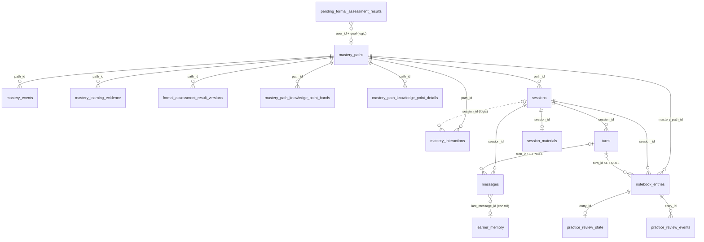

# Database của AI Learning Service (`ai_learning_db`)

- Cập nhật 2026-09-30. Kiểm với migration `V0_1`–`V9` trong `services/ai-learning-service/migrations/` và code của service; khi lệch với `.sdd/database/DATABASE_V5.md` §7 thì code đúng.
- Ví dụ là một câu chuyện xuyên suốt về học viên Lan. Topic, knowledge point (KP), câu hỏi và bài đọc là dữ liệu seed thật của content-service (`V4`, `V6`). Nội dung `state_json`, evidence, event và lịch ôn là output của engine thật (`LearningService`, `FormalResultApplier`, `app/practice/scheduler.py`) chạy trên store in-memory của bộ test; thời gian được căn theo dòng thời gian câu chuyện. UUID phía User, Assessment và AI Learning là giá trị minh họa.
- Không bảng nào có FK sang database của service khác (`user_id`, `knowledge_point_id`… chỉ là tham chiếu logic).

## 1. Tổng quan

17 bảng, chia 6 nhóm. `mastery_paths` là gốc: hầu hết bảng khác treo vào nó qua `path_id`.

| Nhóm | Bảng | Migration | Vai trò |
| --- | --- | --- | --- |
| Lõi mastery | `mastery_paths` | V0_1, V1 | Mỗi dòng là một lộ trình học (Mastery Path) của một học viên cho một learning goal. |
| Lõi mastery | `mastery_interactions` | V0_1 | Mỗi câu hỏi tutor đặt để đo mastery (tool `mastery_*`) là một interaction. |
| Lõi mastery | `mastery_events` | V0_1 | Nhật ký chỉ ghi thêm (append-only) của mọi thay đổi trên path. |
| Lõi mastery | `mastery_learning_evidence` | V2 | Bản sao dạng bảng của `state_json.learning_evidence` để truy vấn theo KP và thời gian mà không phải quét JSON. |
| Kết quả thi chính thức | `formal_assessment_result_versions` | V2 | Sổ ghi “attempt này đã được áp tới version kết quả nào” trên từng path. |
| Kết quả thi chính thức | `pending_formal_assessment_results` | V3 | Phòng chờ cho kết quả thi tới trước khi học viên có path cho goal đó (thường là placement làm trước khi mở app học). |
| Bản chụp Content theo path | `mastery_path_knowledge_point_bands` | V4 | Band IELTS hiệu lực của từng KP trong path, chép từ Content lúc tạo hoặc refresh path. |
| Bản chụp Content theo path | `mastery_path_knowledge_point_details` | V6 | Kỹ năng và mô tả của từng KP, chép từ Content cùng lúc với band. |
| Tutor runtime | `sessions` | V5 | Một phiên học với tutor, luôn gắn với path đang hoạt động của học viên. |
| Tutor runtime | `turns` | V5 | Một lượt hỏi–đáp: học viên gửi một tin, tutor chạy (có thể gọi tool nhiều vòng) và stream kết quả qua SSE. |
| Tutor runtime | `messages` | V5 | Lịch sử hội thoại hiển thị cho học viên: tin của học viên (`user`) và câu trả lời của tutor (`assistant`). |
| Tutor runtime | `session_materials` | V8 | Bản sao chỉ đọc của bài Reading mà session được mở trên đó. |
| Tutor runtime | `learner_memory` | V7 | Một đoạn ghi chú ngắn do tutor tự tóm tắt về từng học viên (điểm yếu, thói quen, sở thích học), dùng chung cho mọi path và session. |
| Sổ luyện tập | `notebook_entries` | V6, V8 | Sổ câu luyện của học viên. |
| Sổ luyện tập | `practice_review_state` | V6 | Lịch ôn hiện tại của một câu luyện đã làm sai. |
| Sổ luyện tập | `practice_review_events` | V6 | Lịch sử từng lần ôn một câu luyện, đồng thời là bảng chống gửi trùng: client gửi `requestId`; gửi lại cùng ID thì nhận lại đúng kết quả cũ trong `outcome_json`, không ôn thêm lần nữa. |
| Hạn mức LLM | `llm_daily_usage` | V9 | Bộ đếm số lần mỗi học viên dùng tác vụ có gọi LLM trong một ngày, để chi phí nhà cung cấp không tăng vô hạn. |

## 2. Quan hệ giữa các bảng

Nét liền là FK thật trong PostgreSQL; nét đứt là tham chiếu logic (không có ràng buộc).



### 2.1 Khóa ngoại thật (16)

| Bảng con | Cột | Bảng cha | Khi xóa cha |
| --- | --- | --- | --- |
| `mastery_interactions` | `path_id` | `mastery_paths` | CASCADE |
| `mastery_events` | `path_id` | `mastery_paths` | CASCADE |
| `mastery_learning_evidence` | `path_id` | `mastery_paths` | CASCADE |
| `formal_assessment_result_versions` | `path_id` | `mastery_paths` | CASCADE |
| `mastery_path_knowledge_point_bands` | `path_id` | `mastery_paths` | CASCADE |
| `mastery_path_knowledge_point_details` | `path_id` | `mastery_paths` | CASCADE |
| `sessions` | `path_id` | `mastery_paths` | CASCADE |
| `notebook_entries` | `mastery_path_id` | `mastery_paths` | CASCADE |
| `turns` | `session_id` | `sessions` | CASCADE |
| `messages` | `session_id` | `sessions` | CASCADE |
| `session_materials` | `session_id` | `sessions` | CASCADE |
| `notebook_entries` | `session_id` | `sessions` | CASCADE |
| `messages` | `turn_id` | `turns` | SET NULL |
| `notebook_entries` | `turn_id` | `turns` | SET NULL |
| `practice_review_state` | `entry_id` | `notebook_entries` | CASCADE |
| `practice_review_events` | `entry_id` | `notebook_entries` | CASCADE |

Hệ quả: xóa một dòng `mastery_paths` xóa theo toàn bộ dữ liệu của path đó, kể cả session, tin nhắn và sổ luyện tập. Xóa hẳn một session xóa turn, tin nhắn, bài đọc và câu luyện của nó. API “xóa session” hiện chỉ archive nên không kích hoạt cascade.

### 2.2 Tham chiếu logic (không FK)

| Bảng | Cột | Trỏ tới | Ghi chú |
| --- | --- | --- | --- |
| `pending_formal_assessment_results` | `(user_id, learning_goal_id)` | `mastery_paths` | chờ path của goal; xóa khi path được tạo |
| `mastery_interactions` | `session_id, turn_id` | `sessions / turns` | không FK (V0_1 tạo trước bảng tutor) |
| `mastery_events` | `session_id, turn_id` | `sessions / turns` | không FK |
| `mastery_learning_evidence` | `session_id, turn_id` | `sessions / turns` | không FK; NULL với kết quả thi |
| `messages` | `metadata_json.question_id / answers_question_id` | `mastery_interactions` | id trong JSON |
| `messages` | `metadata_json.practice_entry_ids` | `notebook_entries` | id trong JSON |
| `learner_memory` | `last_message_id` | `messages.id` | con trỏ: tin có id lớn hơn là chưa tóm tắt |
| `notebook_entries` | `material_id` | `session_materials.section_id` | cùng section Reading |

Tham chiếu ra ngoài database: `user_id` → `user_db.users`, `learning_goal_id` → `user_db.learning_goals`, `knowledge_point_id` → `content_db.knowledge_points`, `section_id`/`package_id` → `content_db`, `attempt_id`/`result_id`/`event_id` → `assessment_db`.

## 3. Câu chuyện ví dụ

Các ID dùng xuyên suốt:

| Đối tượng | ID | Nguồn |
| --- | --- | --- |
| Học viên Lan (`user_id`) | `3f6c2a10-8d4b-4c1e-9a77-1b2c3d4e5f60` | minh họa |
| Learning goal | `5d2e9f14-6a3b-4e8c-b1d0-7c9a2e4f8b31` | minh họa |
| Topic “Demo IELTS Reading” (module) | `10000000-0000-4000-8000-000000000001` | seed content V4 |
| KP “Identify the main idea” (procedure, READING) | `10000000-0000-4000-8000-000000000002` | seed content V4 |
| Section “Reading: main idea” / package | `10000000-0000-4000-8000-000000000005 / 10000000-0000-4000-8000-000000000003` | seed content V4, V6 |
| Path | `9c4f7e21-3b6a-4d8e-a5f2-0e1d2c3b4a59` | minh họa |
| Session | `e7a1c3b5-2d4f-4a6b-8c9d-1e2f3a4b5c6d` | minh họa |
| Câu hỏi mastery 1 / 2 | `4e8a2c6d-1f3b-4a5c-9e7d-2b4c6e8a0f13 / 5f9b3d7e-2a4c-4b6d-8f1e-3c5d7f9b1a24` | minh họa |
| Placement: event / attempt / result | `8a3f5c71-2e9b-4d06-b1a4-6c7d8e9f0a12 / b4d6f8a0-1c3e-4a5b-9d7f-0e2a4c6b8d10 / c5e7a9b1-2d4f-4b6c-8e0a-1f3b5d7c9e21` | minh họa |

Dòng thời gian:

| Lúc | Chuyện gì xảy ra | Bảng bị ghi |
| --- | --- | --- |
| 29/09 19:40 | Lan làm bài placement ở Assessment và đúng câu “main idea”. Event `AssessmentCompleted.v2` tới AI Learning khi Lan chưa có lộ trình cho goal này, nên consumer cất event vào phòng chờ. | `pending_formal_assessment_results` |
| 30/09 13:20 | Lan mở app, gọi `POST /api/ai-learning/paths`. Một transaction tạo path, chép band và mô tả KP từ Content, áp kết quả placement đang chờ (ghi evidence, test-out KP), ghi version đã áp, rồi xóa dòng chờ. Path lên revision 1. | `mastery_paths`, `mastery_path_knowledge_point_bands`, `mastery_path_knowledge_point_details`, `mastery_learning_evidence`, `formal_assessment_result_versions`, `mastery_events`, `pending_formal_assessment_results` |
| 13:21 | Lan mở phiên tutor trên bài đọc “Reading: main idea”. Bài đọc được chép một lần vào DB. | `sessions`, `session_materials` |
| 13:21–13:22 | Lượt 1: tutor hỏi ý chính đoạn B. Lượt 2: Lan chọn A (sai), tutor hỏi tiếp đoạn C. Lượt 3: Lan chọn B (đúng). Mỗi lượt trừ 1 hạn mức, ghi turn và tin nhắn; câu hỏi và kết quả chấm nằm ở interaction; path lên revision 9. | `llm_daily_usage`, `turns`, `messages`, `mastery_interactions`, `mastery_paths`, `mastery_events`, `mastery_learning_evidence` |
| 13:24 | Lượt 4: Lan xin thêm câu luyện. Tutor soạn 3 câu theo KP và 1 câu theo bài đọc vào sổ luyện tập. Đủ 8 tin nhắn mới nên tutor tóm tắt trí nhớ về Lan. | `notebook_entries`, `learner_memory`, `llm_daily_usage` |
| 13:26 | Lan trả lời sai câu luyện 101, câu này vào lịch ôn (đến hạn sau 10 phút). | `notebook_entries`, `practice_review_state` |
| 13:31 | Lượt 5 hỏng vì lỗi LLM ngay lần gọi đầu, lượt bị đóng `failed` và được hoàn hạn mức. | `turns`, `messages`, `llm_daily_usage` |
| 13:40 | Lan ôn lại câu 101 và làm đúng (rating good): lịch giãn ra 3 ngày, lần ôn được lưu lại để chống gửi trùng. | `practice_review_state`, `practice_review_events`, `notebook_entries` |

## 4. Chi tiết từng bảng

### Nhóm: Lõi mastery

Bản port engine DeepTutor: lộ trình học, câu hỏi kiểm tra, nhật ký sự kiện, bằng chứng học.

#### 4.1 `mastery_paths`

Migration `V0_1, V1`. Mỗi dòng là một lộ trình học (Mastery Path) của một học viên cho một learning goal. Toàn bộ trạng thái học của lộ trình nằm trong `state_json`: module, KP, điểm thành thạo, lỗi sai, lịch ôn. Đây là nguồn sự thật duy nhất về mastery; các bảng `mastery_*` khác chỉ là nhật ký hoặc bản sao để truy vấn.

**Quan hệ**
- Là gốc của 8 bảng có FK `path_id` (xóa path thì xóa theo): `mastery_interactions`, `mastery_events`, `mastery_learning_evidence`, `formal_assessment_result_versions`, `mastery_path_knowledge_point_bands`, `mastery_path_knowledge_point_details`, `sessions`, `notebook_entries` (cột `mastery_path_id`).
- `user_id` → `user_db.users`, `learning_goal_id` → `user_db.learning_goals`: chỉ là tham chiếu logic, không có FK vì khác database.

**Cột**

| Cột | Kiểu | Ràng buộc | Dùng để làm gì | Ví dụ |
| --- | --- | --- | --- | --- |
| `path_id` | `uuid` | PK | ID lộ trình. Engine DeepTutor gọi là `book_id`. | `9c4f7e21-3b6a-4d8e-a5f2-0e1d2c3b4a59` |
| `user_id` | `uuid` | NOT NULL | Học viên sở hữu lộ trình. Mọi API đọc path đều lọc theo cột này. | `3f6c2a10-8d4b-4c1e-9a77-1b2c3d4e5f60` |
| `learning_goal_id` | `uuid` | NULL; UNIQUE (user_id, learning_goal_id) khi khác NULL | Learning goal mà lộ trình phục vụ. Mỗi goal của một học viên chỉ có một path (V1). | `5d2e9f14-6a3b-4e8c-b1d0-7c9a2e4f8b31` |
| `state_json` | `jsonb` | NOT NULL | Aggregate `LearningProgress` đã serialize. Chỉ engine được sửa, không sửa bằng SQL tay. | xem bên dưới |
| `revision` | `bigint` | NOT NULL, ≥ 0 | Số lần commit có thay đổi. Mỗi commit chạy `UPDATE … WHERE revision = <cũ>`; lệch là có người sửa song song → `LearningConflictError`. | `9` |
| `owner_session_id` | `uuid` | NULL | Dành cho path nháp gắn với một session (thiết kế DeepTutor). Code hiện không ghi cột này. | `NULL` |
| `created_at` | `timestamptz` | NOT NULL | Lúc tạo path. | `2026-09-30 13:20:00+07` |
| `updated_at` | `timestamptz` | NOT NULL | Lần commit gần nhất. Index `(user_id, updated_at DESC)` để lấy path mới nhất của học viên. | `2026-09-30 13:22:42+07` |

**Bên trong `state_json`**

| Trường | Ý nghĩa |
| --- | --- |
| `modules[]` | Module = một topic của Content, bên trong là các knowledge point (KP) theo thứ tự học. `type` của KP (memory/concept/procedure/design) quyết định KP được chấm bằng điểm số hay bằng nhận xét. |
| `current_stage, current_module_id, current_kp_index` | Vị trí hiện tại trên lộ trình (diagnostic → explain → feynman_check → practice → error_diagnosis → review → completed). |
| `mastery_levels` | Điểm thành thạo 0..1 của từng KP. Công thức (`app/mastery/mastery.py`): trung bình có trọng số 5 lần gần nhất (0.5, 0.7, 0.85, 0.95, 1.0), tối đa 0.5 khi mới 1 lần làm và 0.8 khi mới 2 lần. Ví dụ: đúng, sai, đúng → (0.85 + 1.0) / 2.8 = 0.6607. |
| `qualitative_mastery` | KP loại concept/design qua bằng nhận xét của tutor (true/false) thay vì bằng điểm. |
| `quiz_attempts` | Mọi lần làm bài có chấm đúng/sai (từ tutor và từ Assessment). Với kết quả thi, `question_id` là `source_reference_id`. |
| `error_records` | Lỗi sai được phân loại (structural, deviation, application, metacognitive) để chẩn đoán và ôn. |
| `learning_evidence` | Bằng chứng học dùng để tính lại lịch ôn. Được chép ra bảng `mastery_learning_evidence` mỗi lần commit. |
| `repetition_states, review_queue` | Lịch ôn cách quãng theo KP: độ ổn định trí nhớ, lần ôn kế tiếp, độ ưu tiên. |
| `learner_mastery_overrides` | KP được coi là đã biết mà không cần bằng chứng, ví dụ test-out từ placement (`note` ghi nguồn). |
| `pending_question` | Câu hỏi đang chờ trả lời (bản cũ); câu hỏi hiện tại nằm ở `mastery_interactions`. |
| `learner_profile` | Hồ sơ người học (trình độ, mục tiêu, thời gian, sở thích) khi tutor đã hỏi; `null` là chưa hỏi. |
| `version` | Bằng cột `revision`; store ghi đè khi đọc lên. |

**Ví dụ: `state_json` của path ví dụ (sinh bởi engine thật, rút gọn; thời gian là epoch giây)**
```json
{
  "book_id": "9c4f7e21-3b6a-4d8e-a5f2-0e1d2c3b4a59",
  "learner_profile": null,
  "name": "",
  "diagnostic": null,
  "modules": [{"id": "10000000-0000-4000-8000-000000000001", "name": "Demo IELTS Reading", "order": 0, "pass_threshold": 0.7, "objective": "", "knowledge_points": [{"id": "10000000-0000-4000-8000-000000000002", "name": "Identify the main idea", "type": "procedure", "module_id": "10000000-0000-4000-8000-000000000001"}]}],
  "current_module_id": "10000000-0000-4000-8000-000000000001",
  "current_stage": "diagnostic",
  "current_kp_index": 0,
  "mastery_levels": {"10000000-0000-4000-8000-000000000002": 0.6607142857142858},
  "qualitative_mastery": {},
  "knowledge_types": {"10000000-0000-4000-8000-000000000002": "procedure"},
  "quiz_attempts": [{"question_id": "994c43d8-7eaa-53c6-9053-91daf2a710bd", "knowledge_point_id": "10000000-0000-4000-8000-000000000002", "module_id": "10000000-0000-4000-8000-000000000001", "is_correct": true, "user_answer": null, "error_type": null, "timestamp": 1790749200.0}, {"question_id": "4e8a2c6d-1f3b-4a5c-9e7d-2b4c6e8a0f13", "knowledge_point_id": "10000000-0000-4000-8000-000000000002", "module_id": "10000000-0000-4000-8000-000000000001", "is_correct": false, "user_answer": "A", "error_type": "application", "timestamp": 1790749327.0}, {"question_id": "5f9b3d7e-2a4c-4b6d-8f1e-3c5d7f9b1a24", "knowledge_point_id": "10000000-0000-4000-8000-000000000002", "module_id": "10000000-0000-4000-8000-000000000001", "is_correct": true, "user_answer": "B", "error_type": null, "timestamp": 1790749362.0}],
  "error_records": [{"id": "9ccdb1eafcec45b6b7e68bcdae5206a5", "question_id": "4e8a2c6d-1f3b-4a5c-9e7d-2b4c6e8a0f13", "knowledge_point_id": "10000000-0000-4000-8000-000000000002", "module_id": "10000000-0000-4000-8000-000000000001", "error_type": "application", "retry_history": [], "status": "active", "created_at": 1790749327.0}],
  "learning_evidence": ["… 3 phần tử, xem bảng mastery_learning_evidence …"],
  "repetition_states": {"10000000-0000-4000-8000-000000000002": {"interval_index": 2, "consecutive_correct": 1, "consecutive_wrong": 0, "next_review_at": 1791694146.0, "difficulty": 0.5, "stability": 103.78650798856202, "retrievability": 1.0, "desired_retention": 0.9, "review_count": 3, "lapse_count": 1, "last_review_at": 1790749362.0}},
  "review_queue": [{"id": "review_10000000-0000-4000-8000-000000000002", "knowledge_point_id": "10000000-0000-4000-8000-000000000002", "knowledge_type": "procedure", "due_at": 1791694146.0, "priority": 1, "forgetting_risk": 0.3, "reason": "due in 11 days; retrievability 100%; 1 lapse.", "state": "… giống repetition_states …"}],
  "learner_mastery_overrides": {"10000000-0000-4000-8000-000000000002": {"knowledge_point_id": "10000000-0000-4000-8000-000000000002", "note": "placement:b4d6f8a0-1c3e-4a5b-9d7f-0e2a4c6b8d10:v1", "created_at": 1790749200.0}},
  "pending_question": null,
  "feynman_retries": {},
  "feynman_explanations": {},
  "stage_failure_counts": {},
  "stage_failure_notes": {},
  "version": 9,
  "created_at": 1790749200.0,
  "updated_at": 1790749362.0
}
```

**Ghi chú**
- Sau 9 lần commit: revision 1 là tạo path + áp placement, 2–5 là câu hỏi 1 (đăng ký, hiện thẻ, nhận trả lời, chấm), 6–9 là câu hỏi 2.
- `assessment_type` của 2 evidence từ tutor là `review` vì KP đã có lịch ôn từ lúc áp placement.

#### 4.2 `mastery_interactions`

Migration `V0_1`. Mỗi câu hỏi tutor đặt để đo mastery (tool `mastery_*`) là một interaction. Đáp án đúng được giữ ở server trong `question_json`, nên câu hỏi hỏi ở lượt này có thể chấm tất định ở lượt sau mà LLM không cần nhớ đáp án. Vòng đời: `registered` → `awaiting_input` → `answered` → `graded` (hoặc `abandoned`).

**Quan hệ**
- `path_id` → `mastery_paths` (FK, xóa theo).
- `session_id`, `turn_id` → `sessions`, `turns`: tham chiếu logic, không có FK.
- `interaction_id` chính là `questionId` mà client thấy; `messages.metadata_json.question_id` và `answers_question_id` trỏ về đây.

**Cột**

| Cột | Kiểu | Ràng buộc | Dùng để làm gì | Ví dụ |
| --- | --- | --- | --- | --- |
| `interaction_id` | `uuid` | PK | ID câu hỏi. Client gửi lại ID này khi trả lời. | `4e8a2c6d-1f3b-4a5c-9e7d-2b4c6e8a0f13` |
| `path_id` | `uuid` | FK → mastery_paths, CASCADE | Lộ trình chứa câu hỏi. | `9c4f7e21-3b6a-4d8e-a5f2-0e1d2c3b4a59` |
| `status` | `varchar(30)` | CHECK 5 giá trị | Trạng thái vòng đời. Partial unique index: mỗi path tối đa một câu ở `registered`/`awaiting_input`/`answered`. | `graded` |
| `question_json` | `jsonb` | NOT NULL | `PendingQuestion`: đề, loại (`choice`/`short`), lựa chọn, đáp án, giải thích, độ khó. API không trả `expected_answer`/`explanation` trước khi chấm. | `{"prompt": "What is the main idea of paragraph B?", "expected_answer": "B", …}` |
| `session_id` | `uuid` | NULL | Session tạo hoặc chấm câu hỏi. | `e7a1c3b5-2d4f-4a6b-8c9d-1e2f3a4b5c6d` |
| `turn_id` | `uuid` | NULL | Lượt gần nhất chạm vào câu hỏi. Câu 1 được hỏi ở lượt 1 nhưng chấm ở lượt 2 nên giữ ID lượt 2. | `1c0e9d8f-7a6b-4c5d-8e3f-2a1b0c9d8e7f` |
| `user_answer` | `text` | DEFAULT '' | Câu trả lời thô của học viên. | `A` |
| `result_json` | `jsonb` | DEFAULT {} | Kết quả chấm. | `{"is_correct": false, "knowledge_point_id": "10000000…"}` |
| `created_at` | `timestamptz` | NOT NULL | Lúc đăng ký câu hỏi. | `2026-09-30 13:21:41+07` |
| `updated_at` | `timestamptz` | NOT NULL | Lần đổi trạng thái gần nhất. | `2026-09-30 13:22:07+07` |

**Ví dụ: `question_json` của câu 1 (sinh bởi engine thật)**
```json
{
  "question_id": "4e8a2c6d-1f3b-4a5c-9e7d-2b4c6e8a0f13",
  "knowledge_point_id": "10000000-0000-4000-8000-000000000002",
  "module_id": "10000000-0000-4000-8000-000000000001",
  "prompt": "What is the main idea of paragraph B?",
  "question_type": "choice",
  "expected_answer": "B",
  "options": [{"label": "A", "body": "Rooftops used to hold water tanks"}, {"label": "B", "body": "Green roofs absorb storm rainwater"}, {"label": "C", "body": "Old buildings need reinforcement"}],
  "explanation": "Paragraph B says green roofs absorb rainwater that would otherwise flood drains.",
  "difficulty": "medium",
  "created_at": 1790749301.0
}
```

**Ghi chú**
- Trạng thái chỉ đi tới: `graded` và `abandoned` là trạng thái cuối; store từ chối chuyển ngược (`LearningStoreError`).

#### 4.3 `mastery_events`

Migration `V0_1`. Nhật ký chỉ ghi thêm (append-only) của mọi thay đổi trên path. Mỗi commit ghi các event của nó kèm `revision` sau commit. Dùng để audit, debug và khôi phục. Đây không phải outbox: không có gì gửi ra khỏi service.

**Quan hệ**
- `path_id` → `mastery_paths` (FK, xóa theo). `session_id`, `turn_id` là tham chiếu logic.

**Cột**

| Cột | Kiểu | Ràng buộc | Dùng để làm gì | Ví dụ |
| --- | --- | --- | --- | --- |
| `id` | `bigint` | PK, identity | Số thứ tự vật lý, tăng dần. | `1208` |
| `path_id` | `uuid` | FK → mastery_paths, CASCADE | Path phát event. | `9c4f7e21-3b6a-4d8e-a5f2-0e1d2c3b4a59` |
| `revision` | `bigint` | NOT NULL | Revision của path sau commit chứa event. Nhiều event có thể chung một revision. | `2` |
| `event_type` | `varchar(100)` | NOT NULL | Loại event (danh sách bên dưới). | `interaction.registered` |
| `payload_json` | `jsonb` | DEFAULT {} | Dữ liệu event. Câu hỏi trong payload là bản công khai, không có đáp án. | `{"interaction_id": "4e8a2c6d…", "knowledge_point_id": "10000000…", "question": {…}}` |
| `session_id` | `uuid` | NULL | Session gây ra thay đổi (nếu có). | `e7a1c3b5-2d4f-4a6b-8c9d-1e2f3a4b5c6d` |
| `turn_id` | `uuid` | NULL | Lượt gây ra thay đổi (nếu có). | `0b9d8c7e-6f5a-4b3c-9d2e-1f0a9b8c7d6e` |
| `created_at` | `timestamptz` | NOT NULL | Lúc commit. | `2026-09-30 13:21:41+07` |

**Ví dụ: Các event thật của path ví dụ (engine sinh ra, theo thứ tự)**

| id | revision | event_type | payload_json (rút gọn) | turn_id |
| --- | --- | --- | --- | --- |
| `1201` | `1` | `path.created` | `{}` | `NULL` |
| `1202` | `1` | `path.modules_replaced` | `{"mode": "replace", "module_count": 1, "knowledge_point_count": 1}` | `NULL` |
| `1203` | `1` | `attempt.recorded` | `{"is_correct": true, "source_reference_id": "994c43d8…", …}` | `NULL` |
| `1204` | `1` | `evidence.recorded` | `{"assessment_type": "quiz", "result": "correct", "quality": 1.0, "weight": "1.0", …}` | `NULL` |
| `1205` | `1` | `mastery.overridden` | `{"mastered": true, …}` | `NULL` |
| `1206` | `1` | `placement.tested_out` | `{"attempt_id": "b4d6f8a0…", "result_version": 1, "tested_out": ["10000000…"], "cleared": []}` | `NULL` |
| `1207` | `1` | `assessment.result_applied` | `{"event_id": "8a3f5c71…", "result_version": 1, "superseded_version": null, "recorded_evidence": 1, …}` | `NULL` |
| `1208` | `2` | `interaction.registered` | `{"interaction_id": "4e8a2c6d…", "question": {…}}` | `0b9d8c7e…` |
| `1209` | `3` | `interaction.awaiting_input` | `{"interaction_id": "4e8a2c6d…"}` | `0b9d8c7e…` |
| `1210` | `4` | `interaction.answered` | `{"interaction_id": "4e8a2c6d…"}` | `1c0e9d8f…` |
| `1211` | `5` | `attempt.recorded` | `{"is_correct": false, …}` | `1c0e9d8f…` |
| `1212` | `5` | `evidence.recorded` | `{"assessment_type": "review", "result": "incorrect", "quality": 0.0, …}` | `1c0e9d8f…` |
| `1213` | `5` | `interaction.graded` | `{"is_correct": false, …}` | `1c0e9d8f…` |
| 1214–1219 | 6–9 | (lặp lại chuỗi trên cho câu 2, lần này đúng) | `…` | `1c0e9d8f… / 2d1f0e9a…` |

**Ghi chú**
- Các `event_type` có trong code: `path.created`, `path.modules_replaced`, `path.scope_applied`, `path.scope_refreshed`, `path.ordered`, `path.learner_profile_recorded`, `interaction.registered`, `interaction.awaiting_input`, `interaction.answered`, `interaction.graded`, `attempt.recorded`, `evidence.recorded`, `mastery.assessed`, `mastery.overridden`, `mastery.override_cleared`, `placement.tested_out`, `assessment.result_applied`.

#### 4.4 `mastery_learning_evidence`

Migration `V2`. Bản sao dạng bảng của `state_json.learning_evidence` để truy vấn theo KP và thời gian mà không phải quét JSON. Mỗi lần path commit, store xóa hết dòng của path rồi ghi lại trong cùng transaction, nên bảng không bao giờ lệch với `state_json`. Bảng này là index, không phải nơi quyết định mastery.

**Quan hệ**
- `path_id` → `mastery_paths` (FK, xóa theo).
- `knowledge_point_id` → `content_db.knowledge_points` (logic).
- `source_reference_id` nối về một item của một version kết quả thi ở `assessment_db` (logic).

**Cột**

| Cột | Kiểu | Ràng buộc | Dùng để làm gì | Ví dụ |
| --- | --- | --- | --- | --- |
| `path_id` | `uuid` | PK (1/2), FK → mastery_paths | Path chứa bằng chứng. | `9c4f7e21-3b6a-4d8e-a5f2-0e1d2c3b4a59` |
| `ordinal` | `bigint` | PK (2/2) | Vị trí trong mảng `learning_evidence` (0, 1, 2…). | `0` |
| `knowledge_point_id` | `uuid` | NOT NULL | KP được đo. | `10000000-0000-4000-8000-000000000002` |
| `occurred_at` | `timestamptz` | NOT NULL | Thời điểm của bằng chứng (`timestamp` trong JSON). Với kết quả thi là lúc AI Learning áp kết quả. | `2026-09-30 13:20:00+07` |
| `source` | `varchar(50)` | NOT NULL | `mastery_path` = từ tutor; `assessment_service` = từ bài thi chính thức. | `assessment_service` |
| `source_reference_id` | `uuid` | NULL; UNIQUE (path_id, source, source_reference_id) | Chỉ có với kết quả thi: `uuid5(result_id:result_version:item_result_id:kp_id)`. Unique index chặn ghi trùng khi event bị gửi lại. | `994c43d8-7eaa-53c6-9053-91daf2a710bd` |
| `assessment_type` | `varchar(30)` | NOT NULL | `quiz` (lần đầu đo KP), `review` (KP đã có lịch ôn), `qualitative` (chấm bằng nhận xét). | `quiz` |
| `result` | `varchar(20)` | NOT NULL | `correct`, `incorrect`, `partial`. | `correct` |
| `quality` | `numeric(5,4)` | 0..1 | Độ mạnh của bằng chứng: đúng 1.0, đúng khi đang làm lại 0.6, sai 0.0; qualitative đạt 1.0 hoặc 0.9, trượt 0.2. | `1.0000` |
| `hints_used` | `integer` | DEFAULT 0 | Số gợi ý đã dùng. Code hiện luôn ghi 0. | `0` |
| `attempt_count` | `integer` | DEFAULT 1 | Đây là lần đo thứ mấy của KP này. | `1` |
| `confidence` | `numeric(5,4)` | NULL, 0..1 | Độ tự tin của học viên. Code hiện chưa ghi. | `NULL` |
| `response_time_seconds` | `numeric` | NULL | Thời gian trả lời. Code hiện chưa ghi. | `NULL` |
| `session_id` | `uuid` | NULL | Session tutor sinh ra bằng chứng. NULL với kết quả thi. | `NULL` |
| `turn_id` | `uuid` | NULL | Lượt tutor sinh ra bằng chứng. NULL với kết quả thi. | `NULL` |
| `evidence_json` | `jsonb` | NOT NULL | Bản đầy đủ của `LearningEvidence` để replay/audit. | xem bên dưới |

**Ví dụ: 3 dòng của path ví dụ**

| ordinal | occurred_at | source | source_reference_id | assessment_type | result | quality | attempt_count | turn_id |
| --- | --- | --- | --- | --- | --- | --- | --- | --- |
| `0` | `13:20:00` | `assessment_service` | `994c43d8…` | `quiz` | `correct` | `1.0000` | `1` | `NULL` |
| `1` | `13:22:07` | `mastery_path` | `NULL` | `review` | `incorrect` | `0.0000` | `2` | `1c0e9d8f…` |
| `2` | `13:22:42` | `mastery_path` | `NULL` | `review` | `correct` | `1.0000` | `3` | `2d1f0e9a…` |

**Ví dụ: `evidence_json` của dòng ordinal 0**
```json
{
  "knowledge_point_id": "10000000-0000-4000-8000-000000000002",
  "timestamp": 1790749200.0,
  "source": "assessment_service",
  "assessment_type": "quiz",
  "result": "correct",
  "quality": 1.0,
  "hints_used": 0,
  "attempt_count": 1,
  "confidence": null,
  "response_time": null,
  "session_id": "assessment:b4d6f8a0-1c3e-4a5b-9d7f-0e2a4c6b8d10:c5e7a9b1-2d4f-4b6c-8e0a-1f3b5d7c9e21:1:d6f8b0c2-3e5a-4c7d-9f1b-2a4c6e8d0f32",
  "turn_id": "994c43d8-7eaa-53c6-9053-91daf2a710bd"
}
```

**Ghi chú**
- Với bằng chứng từ bài thi, engine giấu nguồn gốc trong 2 trường có sẵn: `session_id` = `assessment:{attempt}:{result}:{version}:{item_result}`, `turn_id` = `source_reference_id`. Khi chép ra bảng, store đưa giá trị này vào `source_reference_id` và để `session_id`/`turn_id` NULL.

### Nhóm: Kết quả thi chính thức

Nhận `AssessmentCompleted.v2` từ Assessment qua RabbitMQ, áp vào lộ trình đúng một lần.

#### 4.5 `formal_assessment_result_versions`

Migration `V2`. Sổ ghi “attempt này đã được áp tới version kết quả nào” trên từng path. Consumer đọc và cập nhật sổ trong lúc đang khóa dòng `mastery_paths`, nên quyết định bỏ qua/áp/thay thế luôn nguyên tử với thay đổi trên path.

**Quan hệ**
- `path_id` → `mastery_paths` (FK, xóa theo).
- `attempt_id`, `result_id`, `event_id` → `assessment_db` (logic).

**Cột**

| Cột | Kiểu | Ràng buộc | Dùng để làm gì | Ví dụ |
| --- | --- | --- | --- | --- |
| `path_id` | `uuid` | PK (1/2), FK → mastery_paths | Path nhận kết quả. | `9c4f7e21-3b6a-4d8e-a5f2-0e1d2c3b4a59` |
| `attempt_id` | `uuid` | PK (2/2) | Lượt thi. Mọi version chấm lại của một lượt thi dùng chung ID này. | `b4d6f8a0-1c3e-4a5b-9d7f-0e2a4c6b8d10` |
| `result_id` | `uuid` | NOT NULL | Dòng kết quả của version đang áp (mỗi version một ID mới). | `c5e7a9b1-2d4f-4b6c-8e0a-1f3b5d7c9e21` |
| `result_version` | `integer` | > 0 | Version đã áp. Upsert có điều kiện `WHERE result_version < mới` nên không bao giờ lùi. | `1` |
| `event_id` | `uuid` | NOT NULL | ID event RabbitMQ đã mang version này. | `8a3f5c71-2e9b-4d06-b1a4-6c7d8e9f0a12` |
| `applied_at` | `timestamptz` | NOT NULL | Lúc áp. | `2026-09-30 13:20:00+07` |

**Ghi chú**
- Event tới với version bằng version đã áp → bỏ qua (`duplicate`). Nhỏ hơn → bỏ qua (`stale`). Lớn hơn (chấm lại) → gỡ bằng chứng của version cũ khỏi aggregate, tính lại KP liên quan, rồi áp version mới.

#### 4.6 `pending_formal_assessment_results`

Migration `V3`. Phòng chờ cho kết quả thi tới trước khi học viên có path cho goal đó (thường là placement làm trước khi mở app học). Consumer lưu nguyên event rồi ACK. Transaction tạo path sẽ áp các dòng này theo thứ tự `(attempt_id, result_version)` rồi xóa chúng. Dòng không có hạn, nằm đó tới khi path được tạo.

**Quan hệ**
- Không có FK. Nối với `mastery_paths` theo cặp `(user_id, learning_goal_id)`.
- Tạo path và cất event cùng giữ advisory lock `hashtextextended('{user_id}:{learning_goal_id}')`, nên event hoặc được cất trước khi path commit (và được áp khi tạo path), hoặc thấy path đã có và áp thẳng.

**Cột**

| Cột | Kiểu | Ràng buộc | Dùng để làm gì | Ví dụ |
| --- | --- | --- | --- | --- |
| `event_id` | `uuid` | PK | ID event. Event gửi lại vẫn chỉ có một dòng (`ON CONFLICT DO NOTHING`). | `8a3f5c71-2e9b-4d06-b1a4-6c7d8e9f0a12` |
| `user_id` | `uuid` | NOT NULL | Học viên. | `3f6c2a10-8d4b-4c1e-9a77-1b2c3d4e5f60` |
| `learning_goal_id` | `uuid` | NOT NULL | Goal lúc bắt đầu làm bài. | `5d2e9f14-6a3b-4e8c-b1d0-7c9a2e4f8b31` |
| `attempt_id` | `uuid` | NOT NULL | Lượt thi, dùng để sắp thứ tự khi áp. | `b4d6f8a0-1c3e-4a5b-9d7f-0e2a4c6b8d10` |
| `result_version` | `integer` | > 0 | Version kết quả. | `1` |
| `payload` | `jsonb` | NOT NULL | Nguyên văn event `AssessmentCompleted.v2`. | xem bên dưới |
| `received_at` | `timestamptz` | DEFAULT now() | Lúc consumer nhận. | `2026-09-29 19:40:02+07` |

**Ví dụ: `payload` (đúng contract `docs/contracts/assessment-completed-v2.md`)**
```json
{
  "event_id": "8a3f5c71-2e9b-4d06-b1a4-6c7d8e9f0a12",
  "event_type": "AssessmentCompleted.v2",
  "occurred_at": "2026-09-29T12:40:00Z",
  "source": "assessment-service",
  "data": {"user_id": "3f6c2a10-8d4b-4c1e-9a77-1b2c3d4e5f60", "learning_goal_id": "5d2e9f14-6a3b-4e8c-b1d0-7c9a2e4f8b31", "attempt_id": "b4d6f8a0-1c3e-4a5b-9d7f-0e2a4c6b8d10", "result_id": "c5e7a9b1-2d4f-4b6c-8e0a-1f3b5d7c9e21", "result_version": 1, "assessment_type": "PLACEMENT", "status": "COMPLETED", "completed_at": "2026-09-29T12:40:00Z", "overall_band": 5.5, "item_results": [{"item_result_id": "d6f8b0c2-3e5a-4c7d-9f1b-2a4c6e8d0f32", "question_version_id": "10000000-0000-4000-8000-000000000007", "is_correct": true, "score": 1.0, "max_score": 1.0, "knowledge_point_mappings": [{"knowledge_point_id": "10000000-0000-4000-8000-000000000002", "weight": 1.0, "qualitative_judgment": null, "error_type": null}]}]}
}
```

**Ghi chú**
- Trong ví dụ, dòng này tồn tại từ 19:40 ngày 29/09 tới 13:20 ngày 30/09 thì bị xóa khi path được tạo.

### Nhóm: Bản chụp Content theo path

Metadata của knowledge point chép từ Content, để consumer và tutor khỏi gọi Content.

#### 4.7 `mastery_path_knowledge_point_bands`

Migration `V4`. Band IELTS hiệu lực của từng KP trong path, chép từ Content lúc tạo hoặc refresh path. Consumer RabbitMQ không có token của học viên để gọi Content, nên luật test-out của placement đọc band ở đây: KP có `band_max` ≤ `overall_band` của bài placement được coi là đã biết.

**Quan hệ**
- `path_id` → `mastery_paths` (FK, xóa theo).
- `knowledge_point_id` → `content_db.knowledge_points` (logic).

**Cột**

| Cột | Kiểu | Ràng buộc | Dùng để làm gì | Ví dụ |
| --- | --- | --- | --- | --- |
| `path_id` | `uuid` | PK (1/2), FK → mastery_paths | Path. | `9c4f7e21-3b6a-4d8e-a5f2-0e1d2c3b4a59` |
| `knowledge_point_id` | `uuid` | PK (2/2) | KP. | `10000000-0000-4000-8000-000000000002` |
| `band_min` | `numeric(2,1)` | NULL, 0..9 | Cận dưới band. NULL = không giới hạn dưới. | `NULL` |
| `band_max` | `numeric(2,1)` | NULL, 0..9 | Cận trên band. NULL = không giới hạn trên, nên KP không bao giờ được test-out theo band. | `NULL` |

**Ghi chú**
- KP demo trong seed Content không đặt band, nên cả hai cột là NULL. Trong ví dụ, KP vẫn được test-out theo luật thứ hai: mọi câu placement gắn KP đều đúng.
- Nếu KP có `band_max = 5.0` và placement cho `overall_band = 5.5` thì KP được test-out theo band.
- DATABASE_V5 (V5.2) dự kiến xóa bảng này khi KP không còn band; chưa có migration.

#### 4.8 `mastery_path_knowledge_point_details`

Migration `V6`. Kỹ năng và mô tả của từng KP, chép từ Content cùng lúc với band. Tutor đọc bảng này (qua tool) để viết câu luyện đúng trọng tâm mà không cần token hay request thứ hai tới Content.

**Quan hệ**
- `path_id` → `mastery_paths` (FK, xóa theo).
- `knowledge_point_id` → `content_db.knowledge_points` (logic).

**Cột**

| Cột | Kiểu | Ràng buộc | Dùng để làm gì | Ví dụ |
| --- | --- | --- | --- | --- |
| `path_id` | `uuid` | PK (1/2), FK → mastery_paths | Path. | `9c4f7e21-3b6a-4d8e-a5f2-0e1d2c3b4a59` |
| `knowledge_point_id` | `uuid` | PK (2/2) | KP. | `10000000-0000-4000-8000-000000000002` |
| `skill` | `varchar(50)` | NULL | Kỹ năng IELTS của KP theo Content. NULL khi Content không có. | `READING` |
| `description` | `text` | DEFAULT '' | Mô tả KP (tối đa 1.000 ký tự). | `Choose the option that best summarizes the passage.` |

**Ghi chú**
- Refresh path giữ lại dòng của KP đã rời curriculum, giống path giữ KP đã retired. Đây là bản chụp; Content vẫn là nơi sửa.

### Nhóm: Tutor runtime

Phiên học với tutor: session, lượt (turn), tin nhắn, bài đọc đính kèm, trí nhớ về học viên.

#### 4.9 `sessions`

Migration `V5`. Một phiên học với tutor, luôn gắn với path đang hoạt động của học viên. Một session có nhiều lượt (turn) và nhiều tin nhắn.

**Quan hệ**
- `path_id` → `mastery_paths` (FK, xóa theo).
- Là cha của `turns`, `messages`, `session_materials`, `notebook_entries` (FK, xóa theo).

**Cột**

| Cột | Kiểu | Ràng buộc | Dùng để làm gì | Ví dụ |
| --- | --- | --- | --- | --- |
| `id` | `uuid` | PK | ID session. | `e7a1c3b5-2d4f-4a6b-8c9d-1e2f3a4b5c6d` |
| `user_id` | `uuid` | NOT NULL | Chủ session; mọi truy vấn đều lọc theo cột này. | `3f6c2a10-8d4b-4c1e-9a77-1b2c3d4e5f60` |
| `path_id` | `uuid` | FK → mastery_paths, CASCADE | Path mà tutor đọc/ghi mastery trong session. | `9c4f7e21-3b6a-4d8e-a5f2-0e1d2c3b4a59` |
| `title` | `varchar(200)` | DEFAULT 'New session' | Tên hiển thị. Session mở trên bài đọc lấy tiêu đề section nếu client không đặt. | `Reading: main idea` |
| `created_at` | `timestamptz` | NOT NULL | Lúc tạo. | `2026-09-30 13:21:10+07` |
| `updated_at` | `timestamptz` | NOT NULL | Cập nhật mỗi khi có tin nhắn mới; danh sách session sắp theo cột này. | `2026-09-30 13:31:00+07` |
| `archived_at` | `timestamptz` | NULL | `DELETE /tutor/sessions/{id}` chỉ đặt cột này (xóa mềm), không xóa dòng. | `NULL` |

#### 4.10 `turns`

Migration `V5`. Một lượt hỏi–đáp: học viên gửi một tin, tutor chạy (có thể gọi tool nhiều vòng) và stream kết quả qua SSE. Lượt luôn được đóng `completed` hoặc `failed`, kể cả khi lỗi hay client ngắt.

**Quan hệ**
- `session_id` → `sessions` (FK, xóa theo).
- `messages.turn_id` và `notebook_entries.turn_id` trỏ về đây (xóa turn thì các cột đó thành NULL).

**Cột**

| Cột | Kiểu | Ràng buộc | Dùng để làm gì | Ví dụ |
| --- | --- | --- | --- | --- |
| `id` | `uuid` | PK | ID lượt. | `0b9d8c7e-6f5a-4b3c-9d2e-1f0a9b8c7d6e` |
| `session_id` | `uuid` | FK → sessions, CASCADE | Session chứa lượt. | `e7a1c3b5-2d4f-4a6b-8c9d-1e2f3a4b5c6d` |
| `status` | `varchar(20)` | CHECK running / completed / failed | Partial unique index: mỗi session tối đa một lượt `running`; lượt thứ hai đồng thời bị từ chối (409). | `completed` |
| `failure_code` | `varchar(100)` | DEFAULT '' | Mã lỗi máy đọc khi `failed`: `llm_not_configured`, `llm_error`, `too_many_rounds`, `internal_error`, `interrupted`. | `''` |
| `created_at` | `timestamptz` | NOT NULL | Lúc bắt đầu. | `2026-09-30 13:21:30+07` |
| `finished_at` | `timestamptz` | NULL | Lúc kết thúc; NULL khi đang chạy. | `2026-09-30 13:21:44+07` |

**Ví dụ: 5 lượt của session ví dụ**

| id | status | failure_code | created_at | finished_at | Chuyện gì xảy ra |
| --- | --- | --- | --- | --- | --- |
| `0b9d8c7e…` | `completed` | `''` | `13:21:30` | `13:21:44` | Tutor hỏi câu 1 |
| `1c0e9d8f…` | `completed` | `''` | `13:22:05` | `13:22:18` | Chấm câu 1 (sai), hỏi câu 2 |
| `2d1f0e9a…` | `completed` | `''` | `13:22:40` | `13:22:45` | Chấm câu 2 (đúng) |
| `3e2a1f0b…` | `completed` | `''` | `13:24:00` | `13:24:20` | Soạn 4 câu luyện |
| `4f3b2a1c…` | `failed` | `llm_error` | `13:31:00` | `13:31:03` | LLM lỗi ở lần gọi đầu |

**Ghi chú**
- Khi service khởi động, mọi lượt còn `running` (do lần chạy trước bị tắt ngang) được chuyển thành `failed` với `interrupted`.

#### 4.11 `messages`

Migration `V5`. Lịch sử hội thoại hiển thị cho học viên: tin của học viên (`user`) và câu trả lời của tutor (`assistant`). Tool call không lưu thành tin nhắn; câu hỏi và kết quả chấm nằm ở `mastery_interactions`, câu luyện nằm ở `notebook_entries`.

**Quan hệ**
- `session_id` → `sessions` (FK, xóa theo); `turn_id` → `turns` (FK, SET NULL).
- `metadata_json` trỏ logic tới `mastery_interactions` (`question_id`, `answers_question_id`) và `notebook_entries` (`practice_entry_ids`).
- `learner_memory.last_message_id` là con trỏ vào cột `id` của bảng này.

**Cột**

| Cột | Kiểu | Ràng buộc | Dùng để làm gì | Ví dụ |
| --- | --- | --- | --- | --- |
| `id` | `bigint` | PK, identity | ID tăng dần; vừa để sắp thứ tự, vừa làm con trỏ cho learner memory. | `5002` |
| `session_id` | `uuid` | FK → sessions, CASCADE | Session chứa tin. | `e7a1c3b5-2d4f-4a6b-8c9d-1e2f3a4b5c6d` |
| `turn_id` | `uuid` | FK → turns, SET NULL | Lượt sinh ra tin. | `0b9d8c7e-6f5a-4b3c-9d2e-1f0a9b8c7d6e` |
| `role` | `varchar(20)` | CHECK user / assistant | Ai viết. | `assistant` |
| `content` | `text` | NOT NULL | Nội dung hiển thị. | Mình bắt đầu với đoạn B nhé… |
| `metadata_json` | `jsonb` | DEFAULT {} | Liên kết tới dữ liệu khác (khóa bên dưới). | `{"question_id": "4e8a2c6d…"}` |
| `created_at` | `timestamptz` | NOT NULL | Lúc ghi. | `2026-09-30 13:21:44+07` |

**Ví dụ: Tin nhắn của session ví dụ**

| id | turn | role | content | metadata_json |
| --- | --- | --- | --- | --- |
| `5001` | `1` | `user` | Mình muốn luyện tìm ý chính của bài này. | `{}` |
| `5002` | `1` | `assistant` | Mình bắt đầu với đoạn B nhé. Đọc đoạn B rồi chọn ý chính trên thẻ câu hỏi. | `{"question_id": "4e8a2c6d…"}` |
| `5003` | `2` | `user` | `A` | `{"answers_question_id": "4e8a2c6d…"}` |
| `5004` | `2` | `assistant` | Chưa đúng: A là ý của đoạn A. Đoạn B nói mái nhà xanh hấp thụ nước mưa. Thử tiếp đoạn C. | `{"question_id": "5f9b3d7e…"}` |
| `5005` | `3` | `user` | `B` | `{"answers_question_id": "5f9b3d7e…"}` |
| `5006` | `3` | `assistant` | Chính xác! Đoạn C xoay quanh nhiệt độ: mái trồng cây mát hơn bê tông. | `{}` |
| `5007` | `4` | `user` | Cho mình thêm vài câu luyện nhé. | `{}` |
| `5008` | `4` | `assistant` | Mình đã tạo 4 câu luyện, bạn làm trên các thẻ bên dưới. | `{"practice_entry_ids": [101, 102, 103, 104]}` |
| `5009` | `5` | `user` | Giải thích lại đoạn D giúp mình. | {} (lượt hỏng, không có tin assistant) |

**Ghi chú**
- Khóa trong `metadata_json`: tin `user` có `answers_question_id` khi đó là câu trả lời cho thẻ câu hỏi; tin `assistant` có `question_id` khi tutor vừa đặt câu hỏi mastery và `practice_entry_ids` khi vừa tạo câu luyện.

#### 4.12 `session_materials`

Migration `V8`. Bản sao chỉ đọc của bài Reading mà session được mở trên đó. Chép một lần lúc tạo session bằng token của học viên (internal JWT chỉ sống 60 giây), nên các lượt tutor sau không phải gọi Content.

**Quan hệ**
- `session_id` → `sessions` (PK và FK, xóa theo): mỗi session tối đa một bài đọc.
- `section_id`, `package_id` → `content_db.content_sections`, `content_packages` (logic). `notebook_entries.material_id` trỏ tới cùng `section_id`.

**Cột**

| Cột | Kiểu | Ràng buộc | Dùng để làm gì | Ví dụ |
| --- | --- | --- | --- | --- |
| `session_id` | `uuid` | PK, FK → sessions, CASCADE | Session dùng bài đọc. | `e7a1c3b5-2d4f-4a6b-8c9d-1e2f3a4b5c6d` |
| `material_type` | `varchar(20)` | CHECK 'READING' | Loại tài liệu; hiện chỉ có Reading. | `READING` |
| `section_id` | `uuid` | NOT NULL | Section Reading gốc ở Content. | `10000000-0000-4000-8000-000000000005` |
| `package_id` | `uuid` | NOT NULL | Gói nội dung chứa section. | `10000000-0000-4000-8000-000000000003` |
| `title` | `text` | NOT NULL | Tiêu đề section lúc chép. | `Reading: main idea` |
| `instructions` | `text` | DEFAULT '' | Hướng dẫn của section. | `Read the passage and choose its main idea.` |
| `paragraphs` | `jsonb` | NOT NULL | Các đoạn `[{label, text}]`, tối đa 20.000 ký tự, cắt ở ranh giới đoạn. | xem bên dưới |
| `fetched_at` | `timestamptz` | NOT NULL | Lúc chép. | `2026-09-30 13:21:10+07` |

**Ví dụ: `paragraphs` (bài đọc seed thật của content-service `V6`, văn bản rút gọn)**
```json
[
  {"label": "A", "text": "Urban rooftops were once seen as wasted space. In many cities they held little more than water tanks and air-conditioning units, …"},
  {"label": "B", "text": "Over the past two decades, however, planners have begun to treat roofs as a resource. Green roofs, covered with soil and low-growing plants, absorb rainwater …"},
  {"label": "C", "text": "Supporters also point to temperature. A planted roof stays noticeably cooler than bare concrete in summer, …"},
  {"label": "D", "text": "Critics accept these benefits but question the cost. Older buildings often need structural reinforcement …"},
  {"label": "E", "text": "Most researchers therefore conclude that green roofs are worthwhile mainly for new buildings, …"}
]
```

**Ghi chú**
- Content sửa bài thì bản sao không đổi; muốn bản mới thì mở session mới.

#### 4.13 `learner_memory`

Migration `V7`. Một đoạn ghi chú ngắn do tutor tự tóm tắt về từng học viên (điểm yếu, thói quen, sở thích học), dùng chung cho mọi path và session. Tutor đọc nó ở đầu mỗi lượt để cá nhân hóa. Học viên xem được và xóa được.

**Quan hệ**
- Không có FK. `user_id` → `user_db.users` (logic).
- `last_message_id` là con trỏ vào `messages.id`: mọi tin có id lớn hơn là tin chưa tóm tắt. Không phụ thuộc session nên còn nguyên khi session bị xóa.

**Cột**

| Cột | Kiểu | Ràng buộc | Dùng để làm gì | Ví dụ |
| --- | --- | --- | --- | --- |
| `user_id` | `uuid` | PK | Học viên. | `3f6c2a10-8d4b-4c1e-9a77-1b2c3d4e5f60` |
| `content` | `text` | DEFAULT '', ≤ 2.000 ký tự | Nội dung ghi nhớ. | Học viên đang luyện IELTS Reading, dạng tìm ý chính… |
| `last_message_id` | `bigint` | DEFAULT 0, ≥ 0 | Id tin nhắn lớn nhất đã được tóm tắt (tính trên mọi session của học viên). | `5008` |
| `version` | `bigint` | DEFAULT 0 | Optimistic lock: ghi kèm `WHERE version = <cũ>`, để kết quả tóm tắt cũ hoặc chạy đua với thao tác xóa bị bỏ. | `1` |
| `updated_at` | `timestamptz` | NOT NULL | Lần ghi hoặc xóa gần nhất. | `2026-09-30 13:24:25+07` |

**Ví dụ: `content` của Lan sau lượt 4**
```text
Học viên đang luyện IELTS Reading, dạng tìm ý chính (main idea). Hay chọn nhầm ý của đoạn khác thay vì ý bao quát của đoạn được hỏi. Làm đúng khi được nhắc đọc câu chủ đề và câu kết đoạn. Thích lời giải thích ngắn, bằng tiếng Việt.
```

**Ghi chú**
- Sau mỗi lượt `completed`, tác vụ nền chỉ gọi LLM khi có ít nhất 8 tin mới; mỗi đợt lấy tối đa 40 tin cũ nhất. Trong ví dụ, lượt 4 kết thúc là đủ 8 tin (5001–5008).
- `DELETE /api/ai-learning/tutor/memory`: `content` thành chuỗi rỗng và con trỏ nhảy tới id tin lớn nhất hiện có, nên tin cũ không bị tóm tắt lại.

### Nhóm: Sổ luyện tập

Câu luyện tutor soạn, câu trả lời, lịch ôn lại câu sai. Không ảnh hưởng mastery.

#### 4.14 `notebook_entries`

Migration `V6, V8`. Sổ câu luyện của học viên. Mỗi dòng là một câu tutor soạn trong một lượt (tool `practice_questions` theo KP hoặc `reading_questions` theo bài đọc), kèm câu trả lời lần đầu của học viên. Luyện tập không đổi mastery, revision hay evidence của path.

**Quan hệ**
- `session_id` → `sessions` (FK, xóa theo); `turn_id` → `turns` (FK, SET NULL); `mastery_path_id` → `mastery_paths` (FK, xóa theo).
- Là cha của `practice_review_state` (1–0..1) và `practice_review_events` (1–n).
- `knowledge_point_id` → `content_db.knowledge_points`, `material_id` → `content_db.content_sections` (logic). CHECK: phải có ít nhất một trong hai.

**Cột**

| Cột | Kiểu | Ràng buộc | Dùng để làm gì | Ví dụ |
| --- | --- | --- | --- | --- |
| `id` | `bigint` | PK, identity | ID câu luyện (`entryId` trên API). | `101` |
| `user_id` | `uuid` | NOT NULL | Chủ sổ; mọi API lọc theo cột này. | `3f6c2a10-8d4b-4c1e-9a77-1b2c3d4e5f60` |
| `session_id` | `uuid` | FK → sessions, CASCADE | Session tạo câu. | `e7a1c3b5-2d4f-4a6b-8c9d-1e2f3a4b5c6d` |
| `turn_id` | `uuid` | NULL, FK → turns, SET NULL | Lượt tạo câu. | `3e2a1f0b-9c8d-4e7f-a05b-4c3d2e1f0a9b` |
| `mastery_path_id` | `uuid` | FK → mastery_paths, CASCADE | Path của session. | `9c4f7e21-3b6a-4d8e-a5f2-0e1d2c3b4a59` |
| `knowledge_point_id` | `uuid` | NULL (từ V8) | KP mà câu luyện; NULL với câu hỏi trên bài đọc. | `10000000-0000-4000-8000-000000000002` |
| `knowledge_point_name` | `text` | DEFAULT '' | Tên KP lúc tạo (bản chụp). | `Identify the main idea` |
| `material_id` | `uuid` | NULL (V8) | Section Reading khi câu hỏi dựa trên bài đọc. | `NULL` |
| `material_title` | `text` | DEFAULT '' (V8) | Tiêu đề bài đọc lúc tạo. | `''` |
| `question_id` | `varchar(255)` | NOT NULL; UNIQUE (session_id, turn_id, question_id) | UUID do AI Learning sinh cho câu; unique giúp lưu lại lượt không tạo trùng. | `6a7b8c9d-0e1f-4a2b-8c3d-4e5f6a7b8c9d` |
| `question` | `text` | NOT NULL | Đề bài. | “Critics accept these benefits but question the cost.” What is the main idea of this paragraph? |
| `question_type` | `varchar(20)` | CHECK short / choice | Chỉ những dạng chấm tất định được. | `choice` |
| `options_json` | `jsonb` | DEFAULT [] | Lựa chọn `[{label, body}]` với câu `choice`; `[]` với câu `short`. | `[{"label": "A", "body": "Green roofs bring many benefits"}, …]` |
| `correct_answer` | `text` | NOT NULL | Đáp án. API chỉ trả sau khi học viên đã trả lời. | `B` |
| `explanation` | `text` | DEFAULT '' | Lời giải; cũng chỉ trả sau khi trả lời. | Câu đầu chỉ nhắc lại lợi ích để chuyển ý; trọng tâm đoạn là chi phí. |
| `difficulty` | `varchar(20)` | DEFAULT '' | `easy`, `medium`, `hard` hoặc rỗng. | `medium` |
| `source` | `varchar(50)` | DEFAULT 'tutor_practice' | `tutor_practice` (theo KP) hoặc `tutor_reading` (theo bài đọc). | `tutor_practice` |
| `user_answer` | `text` | DEFAULT '' | Câu trả lời lần đầu. Ôn lại không ghi đè (lịch sử ôn ở `practice_review_events`). | `A` |
| `result` | `varchar(20)` | CHECK '' / correct / incorrect | Kết quả lần trả lời đầu; rỗng khi chưa trả lời. | `incorrect` |
| `is_correct` | `boolean` | DEFAULT false | Cờ đúng/sai của lần trả lời đầu. | `false` |
| `answered_at` | `timestamptz` | NULL | NULL = chưa trả lời; mỗi câu chỉ được trả lời một lần (lần hai trả 409). | `2026-09-30 13:26:10+07` |
| `resolved` | `boolean` | DEFAULT false | Câu sai đã được ôn xong chưa (3 lần ôn đúng liên tiếp). | `false` |
| `created_at` | `timestamptz` | NOT NULL | Lúc tạo. | `2026-09-30 13:24:12+07` |
| `updated_at` | `timestamptz` | NOT NULL | Lần cập nhật gần nhất. | `2026-09-30 13:40:00+07` |

**Ví dụ: Hai câu trong lượt 4: một câu theo KP, một câu theo bài đọc**

| id | source | knowledge_point_id | material_id | question_type | user_answer | result | answered_at | resolved |
| --- | --- | --- | --- | --- | --- | --- | --- | --- |
| `101` | `tutor_practice` | `10000000…` | `NULL` | `choice` | `A` | `incorrect` | `13:26:10` | `false` |
| `104` | `tutor_reading` | `NULL` | `10000000…` | `short` | `''` | `''` | `NULL` | `false` |

**Ghi chú**
- Câu 104: “In paragraph E, for which buildings are green roofs mainly worthwhile?”, đáp án `new buildings`, `material_title` = “Reading: main idea”. Chưa trả lời nên API chưa lộ đáp án.

#### 4.15 `practice_review_state`

Migration `V6`. Lịch ôn hiện tại của một câu luyện đã làm sai. Dòng được tạo khi học viên trả lời sai lần đầu. Đây là lịch theo từng câu hỏi, khác với lịch ôn theo KP trong `mastery_paths.state_json.repetition_states`.

**Quan hệ**
- `entry_id` → `notebook_entries` (PK và FK, xóa theo): mỗi câu tối đa một dòng lịch.

**Cột**

| Cột | Kiểu | Ràng buộc | Dùng để làm gì | Ví dụ |
| --- | --- | --- | --- | --- |
| `entry_id` | `bigint` | PK, FK → notebook_entries, CASCADE | Câu luyện được lên lịch. | `101` |
| `is_mistake` | `boolean` | DEFAULT true | Còn trong danh sách ôn không. Thành false khi `streak` đạt 3; lúc đó `notebook_entries.resolved` = true. | `true` |
| `first_wrong_at` | `timestamptz` | NOT NULL | Lần sai đầu tiên. | `2026-09-30 13:26:10+07` |
| `due_at` | `timestamptz` | NOT NULL | Lần ôn kế tiếp. Index `(due_at) WHERE is_mistake` phục vụ `GET /practice/due`. | `2026-10-03 13:40:00+07` |
| `interval_days` | `numeric(8,3)` | DEFAULT 1, > 0 | Khoảng cách hiện tại (ngày). | `3.000` |
| `ease` | `numeric(4,2)` | DEFAULT 2.5, 1.3..3.0 | Hệ số nhân khoảng cách. | `2.50` |
| `streak` | `integer` | DEFAULT 0 | Số lần ôn đúng liên tiếp. | `1` |
| `lapses` | `integer` | DEFAULT 0 | Số lần quên (ôn sai). | `0` |
| `review_count` | `integer` | DEFAULT 0 | Tổng số lần ôn. | `1` |
| `last_review_at` | `timestamptz` | NULL | Lần ôn gần nhất. | `2026-09-30 13:40:00+07` |
| `version` | `bigint` | DEFAULT 0 | Tăng mỗi lần ôn; chặn ghi đè bởi request cũ. | `1` |

**Ví dụ: Diễn biến thật của câu 101 (chạy `app/practice/scheduler.py`)**

| Thời điểm | Sự kiện | interval_days | ease | streak | due_at | is_mistake |
| --- | --- | --- | --- | --- | --- | --- |
| `30/09 13:26` | Trả lời sai lần đầu | `1` | `2.50` | `0` | 30/09 13:36 (+10 phút) | `true` |
| `30/09 13:40` | Ôn: đúng, good | `3` | `2.50` | `1` | `03/10 13:40` | `true` |
| `03/10` | Ôn: đúng, good | `7.5` | `2.50` | `2` | +7.5 ngày | `true` |
| `~11/10` | Ôn: đúng, easy | `24.375` | `2.65` | `3` | +24.4 ngày | false → resolved |

**Ghi chú**
- Luật: `again` (hoặc trả lời sai) → 10 phút, streak về 0, lapses +1, ease −0.20; `hard` → ×1.2, ease −0.15; `good` → 3 ngày ở lần ôn đầu, sau đó ×ease; `easy` → như good rồi ×1.3, ease +0.15. Khoảng cách tối đa 365 ngày.

#### 4.16 `practice_review_events`

Migration `V6`. Lịch sử từng lần ôn một câu luyện, đồng thời là bảng chống gửi trùng: client gửi `requestId`; gửi lại cùng ID thì nhận lại đúng kết quả cũ trong `outcome_json`, không ôn thêm lần nữa.

**Quan hệ**
- `entry_id` → `notebook_entries` (FK, xóa theo).

**Cột**

| Cột | Kiểu | Ràng buộc | Dùng để làm gì | Ví dụ |
| --- | --- | --- | --- | --- |
| `request_id` | `uuid` | PK | Khóa idempotency do client sinh. | `7c1d2e3f-4a5b-4c6d-8e9f-0a1b2c3d4e5f` |
| `entry_id` | `bigint` | FK → notebook_entries, CASCADE | Câu được ôn. | `101` |
| `user_id` | `uuid` | NOT NULL | Người ôn; request trùng ID của người khác bị từ chối. | `3f6c2a10-8d4b-4c1e-9a77-1b2c3d4e5f60` |
| `rating` | `varchar(10)` | CHECK again / hard / good / easy | Rating thực tế đã áp: trả lời sai luôn thành `again` dù client gửi gì. | `good` |
| `answer` | `text` | NOT NULL | Câu trả lời trong lần ôn. | `B` |
| `reviewed_at` | `timestamptz` | NOT NULL | Lúc ôn. | `2026-09-30 13:40:00+07` |
| `outcome_json` | `jsonb` | NOT NULL | Kết quả đã trả cho client. | xem bên dưới |

**Ví dụ: `outcome_json`**
```json
{
  "entry_id": 101,
  "question_id": "6a7b8c9d-0e1f-4a2b-8c3d-4e5f6a7b8c9d",
  "is_correct": true,
  "rating": "good",
  "due_at": "2026-10-03T06:40:00+00:00",
  "resolved": false,
  "correct_answer": "B",
  "explanation": "Câu đầu chỉ nhắc lại lợi ích để chuyển ý; trọng tâm đoạn là chi phí."
}
```

### Nhóm: Hạn mức LLM

Đếm số lần gọi LLM mỗi ngày của từng học viên.

#### 4.17 `llm_daily_usage`

Migration `V9`. Bộ đếm số lần mỗi học viên dùng tác vụ có gọi LLM trong một ngày, để chi phí nhà cung cấp không tăng vô hạn. Mặc định 50 lượt tutor và 10 lần tóm tắt memory mỗi ngày (`AI_LEARNING_TUTOR_TURNS_PER_DAY`, `AI_LEARNING_MEMORY_SUMMARIES_PER_DAY`; 0 = không giới hạn nhưng vẫn đếm).

**Quan hệ**
- Không có FK. `user_id` → `user_db.users` (logic).

**Cột**

| Cột | Kiểu | Ràng buộc | Dùng để làm gì | Ví dụ |
| --- | --- | --- | --- | --- |
| `user_id` | `uuid` | PK (1/3) | Học viên. | `3f6c2a10-8d4b-4c1e-9a77-1b2c3d4e5f60` |
| `usage_date` | `date` | PK (2/3) | Ngày theo múi giờ `AI_LEARNING_QUOTA_TIMEZONE` (mặc định Asia/Ho_Chi_Minh), do PostgreSQL tính. Qua nửa đêm là dòng mới. | `2026-09-30` |
| `kind` | `varchar(30)` | PK (3/3), CHECK tutor_turn / memory_summary | Loại tác vụ. | `tutor_turn` |
| `used` | `integer` | ≥ 0 | Số lần đã dùng trong ngày. | `4` |

**Ví dụ: Hai dòng của Lan ngày 30/09**

| user_id | usage_date | kind | used |
| --- | --- | --- | --- |
| `3f6c2a10…` | `2026-09-30` | `tutor_turn` | `4` |
| `3f6c2a10…` | `2026-09-30` | `memory_summary` | `1` |

**Ghi chú**
- Đếm bằng một câu `INSERT … ON CONFLICT DO UPDATE SET used = used + 1 WHERE used < limit`, nên request đồng thời không vượt mức; hết mức thì API trả 429.
- Lượt 5 bị tính rồi được hoàn (−1) vì hỏng với `llm_error` ngay ở lần gọi model đầu tiên, nên `used` vẫn là 4. Nếu model đã trả lời ít nhất một vòng rồi mới lỗi thì lượt vẫn bị tính.

## 5. API nào đọc/ghi bảng nào

Đường dẫn tương đối với `/api/ai-learning`, trừ khi ghi đầy đủ.

| Luồng | Bảng |
| --- | --- |
| `POST /api/ai-learning/paths` | Tạo/refresh path: `mastery_paths`, `mastery_events`, `mastery_path_knowledge_point_bands`, `mastery_path_knowledge_point_details`; khi tạo mới còn áp `pending_formal_assessment_results` → `mastery_learning_evidence`, `formal_assessment_result_versions`, rồi xóa dòng chờ. |
| Consumer `ai-learning.assessment-completed.v2` | Có path: `mastery_paths`, `mastery_learning_evidence`, `mastery_events`, `formal_assessment_result_versions`. Chưa có path: `pending_formal_assessment_results`. |
| `GET /progress`, `/status`, `/paths/{id}/map` | Chỉ đọc `mastery_paths`. |
| `POST /tutor/sessions` | `sessions`, thêm `session_materials` khi có `readingSectionId`. |
| `DELETE /tutor/sessions/{id}` | Đặt `sessions.archived_at`. |
| `POST /tutor/sessions/{id}/turns` (SSE) | `llm_daily_usage` (tutor_turn), `turns`, `messages`; qua tool: `mastery_interactions`, `mastery_paths`, `mastery_events`, `mastery_learning_evidence`, `notebook_entries`. Sau lượt: `learner_memory`, `llm_daily_usage` (memory_summary). |
| `GET /tutor/usage` | Đọc `llm_daily_usage`. |
| `GET` / `DELETE /tutor/memory` | Đọc / xóa `learner_memory`. |
| `GET /practice/notebook`, `/practice/due` | Đọc `notebook_entries` (+ `practice_review_state`). |
| `POST /practice/entries/{entryId}/answer` | `notebook_entries`; trả lời sai thì thêm `practice_review_state`. |
| `POST /practice/reviews` | `practice_review_state`, `notebook_entries.resolved`, `practice_review_events`. |

## 6. Bảng chưa có migration

`.sdd/database/DATABASE_V5.md` §7 mô tả thêm các bảng dưới đây cho luồng học bài; chưa có migration nào tạo chúng.

| Bảng | Mục | Dự kiến dùng để |
| --- | --- | --- |
| `topic_progress` | §7.21 | Tiến độ topic theo học viên (LOCKED / IN_PROGRESS / PASSED). |
| `lesson_progress` | §7.22 | Tiến độ từng bài học, khối bài tập đã đạt, KP bài dạy. |
| `lesson_exercise_submissions` | §7.23 | Nhật ký từng lần nộp khối bài tập (chống nộp trùng bằng `request_id`). |
| `path_review_items` | §7.24 | Bài ôn / luyện thêm bắt buộc khi KP yếu. |
| `path_review_sets` | §7.25 | Gói PRACTICE_SET đã giao cho một bài ôn. |
| `topic_test_assignments` | §7.26 | Mã đề TOPIC_TEST đã giao cho học viên. |
| `mastery_path_sessions, mastery_path_leases, turn_events` | §7.2, §7.6, §7.10 | Thiết kế DeepTutor gốc; không làm vì tutor chạy một instance, dùng row lock và SSE trực tiếp. |

## 7. Câu hỏi còn mở

- `mastery_paths.owner_session_id` không được code nào ghi; giữ lại cho path nháp hay bỏ?
- `pending_formal_assessment_results` không có hạn: kết quả của goal mà học viên không bao giờ mở path sẽ nằm mãi.
- DATABASE_V5 (V5.2) dự kiến đổi `mastery_paths` sang một path mỗi học viên (`UNIQUE (user_id)`) và xóa `mastery_path_knowledge_point_bands`; khi làm cần migration mới, tài liệu này phải cập nhật theo.
