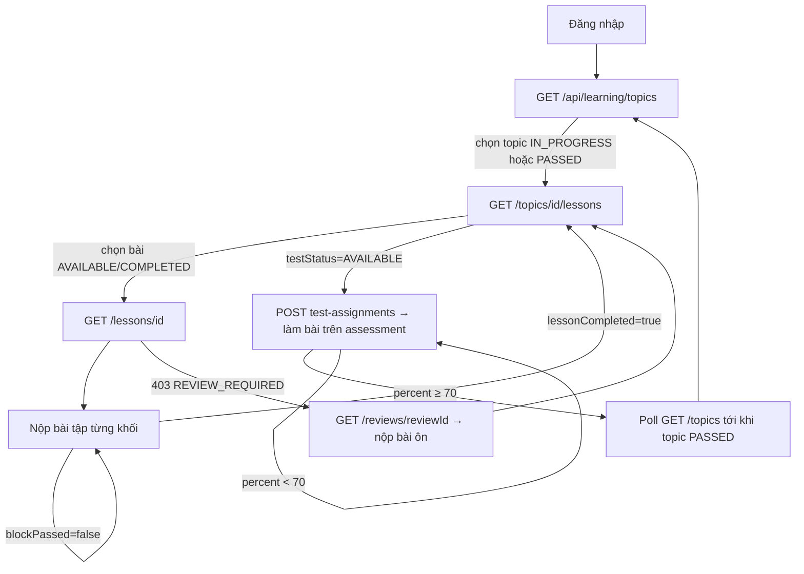

# Hướng dẫn FE: thứ tự gọi API luồng học chính (MVP)

- Cập nhật: 2026-10-02. Đối tượng: dev FE ghép luồng học Reading → Writing → Listening.
- Tài liệu chỉ nói **gọi API nào, khi nào, đọc trường nào**. Giao diện do FE tự thiết kế.
- Chi tiết từng trường: [`contracts/lesson-learning-v1.md`](contracts/lesson-learning-v1.md),
  [`contracts/lesson-writing-v1.md`](contracts/lesson-writing-v1.md). Thử API trực tiếp: Swagger UI ở
  `{BASE_URL}/swagger-ui.html`.

## 1. Quy ước chung

| Mục | Quy ước |
| --- | --- |
| Base URL | Mọi request đi qua Gateway: `http://localhost:8080` (đổi được bằng `MVP_GATEWAY_PORT` khi chạy `docker-compose.mvp.yml`). Không gọi thẳng cổng service. |
| CORS | Gateway cho phép mọi origin `http://localhost:*` và `http://127.0.0.1:*`, cùng `FRONTEND_ORIGIN` (mặc định `http://localhost:5173`). |
| Xác thực | Header `Authorization: Bearer <accessToken>` cho mọi API trừ đăng ký, đăng nhập, refresh. Thiếu/hết hạn token → `401`. |
| `requestId` | Các API nộp bài (bài tập, bài ôn, bài luận) bắt buộc `requestId` dạng UUID do FE sinh (`crypto.randomUUID()`). Gửi lại **cùng** `requestId` (mạng lỗi, timeout) thì nhận lại đúng kết quả cũ, không bị tính hai lần. Lần làm lại mới thì sinh `requestId` mới. |
| Lỗi | Có hai dạng body. Learning: `{detail, code, reviews?}`. Các service khác và Gateway: `{timestamp, status, error, message, path, details}` (assessment có thêm `code` ở vài lỗi). FE nên đọc `code` nếu có, nếu không thì dựa vào HTTP status. |
| Thời gian | Chấm bài luận chạy đồng bộ, thường 10–45 giây: đặt timeout request ≥ 60 giây. |

Tài khoản demo (có sẵn khi bật `DEMO_DATA_ENABLED`): `learner@ielts.demo` / `Demo@123` (học viên, ví 30 điểm),
`admin@ielts.demo` / `Demo@123` (quản trị).

## 2. Bản đồ màn hình → API

| Màn hình | API gọi khi vào màn | Hành động trên màn |
| --- | --- | --- |
| Đăng ký / đăng nhập | — | `POST /api/users/register`, `POST /auth/login` |
| Khởi động app (đã có token) | `GET /api/users/me`, `GET /api/access/me/points` | `POST /auth/refresh` khi gặp `401` |
| Lộ trình (danh sách topic) | `GET /api/learning/topics` | Chọn topic |
| Topic (danh sách bài học) | `GET /api/learning/topics/{topicId}/lessons` | Chọn bài, bấm "Làm bài kiểm tra" |
| Bài học | `GET /api/learning/lessons/{lessonId}` | Nộp bài tập, nộp bài luận |
| Bài ôn | `GET /api/learning/reviews/{reviewId}` | Nộp bài ôn |
| Bài kiểm tra cuối topic | `POST .../test-assignments` → `POST /api/assessments/attempts` → `GET .../structure` | Lưu từng câu, nộp bài, xem kết quả |
| Tiến độ kỹ năng (tuỳ chọn) | `GET /api/learning/mastery` | — |

## 3. Sơ đồ luồng



## 4. Kịch bản luồng chính (theo tài khoản demo)

Mỗi bước ghi: gọi gì → đọc trường nào → FE làm gì tiếp.

### Bước 1. Đăng nhập

1. `POST /auth/login` body `{"email":"learner@ielts.demo","password":"Demo@123"}`.
   Trả `{accessToken, refreshToken, tokenType, expiresIn, refreshExpiresIn}` (`expiresIn` tính bằng giây). Lưu cả hai token.
   Server cũng set cookie, nhưng FE nên dùng header `Authorization`.
2. `GET /api/users/me` → `{id, email, fullName, roles[{name}]...}` để hiện tên.
3. `GET /api/access/me/points` → `{balance, ...}`. Hiện số điểm: chấm một bài luận tốn 3 điểm. Tài khoản mới có
   `balance = 0`; admin nạp điểm qua `POST /api/access/admin/points/adjust`.

Người dùng mới: `POST /api/users/register` body `{email, password (6–72 ký tự), fullName, phoneNumber?}` → `201`,
**không** trả token, nên gọi tiếp `POST /auth/login`. Gặp `401` khi đang dùng: `POST /auth/refresh` body
`{"refreshToken":"..."}` để lấy cặp token mới; refresh cũng lỗi thì về màn đăng nhập. Đăng xuất:
`POST /auth/logout` body `{"refreshToken":"..."}`.

### Bước 2. Màn lộ trình

`GET /api/learning/topics` → mảng đã sắp theo `sequenceOrder`:

```json
[
  {"topicId":"…","code":"DEMO_READING","name":"Demo IELTS Reading","sequenceOrder":1,"status":"IN_PROGRESS","completedLessonCount":0,"accessLevel":"FREE"},
  {"topicId":"…","code":"TFNG_SKILLS","name":"True / False / Not Given","sequenceOrder":2,"status":"LOCKED","completedLessonCount":0,"accessLevel":"FREE"},
  {"topicId":"…","code":"PREMIUM_MATCHING_INFO","name":"Matching Information","sequenceOrder":4,"status":"LOCKED","completedLessonCount":0,"accessLevel":"PREMIUM"}
]
```

| Trường | FE hiển thị |
| --- | --- |
| `status = PASSED` | Đã xong, vẫn mở để xem lại. |
| `status = IN_PROGRESS` | Topic đang học (luôn chỉ có **một**). |
| `status = LOCKED` | Chưa tới lượt, disable. |
| `accessLevel = PREMIUM` | Nội dung trả phí: hiện nhãn trả phí và disable, kể cả khi `status` khác `LOCKED`. |

Chỉ cho bấm vào topic `IN_PROGRESS` hoặc `PASSED` (topic `LOCKED` gọi tiếp sẽ nhận `403 TOPIC_LOCKED`).

### Bước 3. Màn topic

`GET /api/learning/topics/{topicId}/lessons` →
`{topicId, testStatus, lessons:[{lessonId, code, title, sortOrder, status}]}`.

- Bài `AVAILABLE` hoặc `COMPLETED`: cho mở. Bài `LOCKED`: disable (phải xong bài trước).
- `testStatus`: `LOCKED` (chưa xong hết bài hoặc còn bài ôn), `AVAILABLE` (hiện nút làm bài kiểm tra), `PASSED`.
- Gọi lại API này mỗi khi quay về màn topic (sau khi xong bài, xong bài ôn, xong bài kiểm tra).

### Bước 4. Màn bài học

`GET /api/learning/lessons/{lessonId}` → `{lessonId, topicId, code, title, summary, sortOrder, status, blocks[]}`.
Render `blocks` theo thứ tự:

| Khối | Nhận biết | Render |
| --- | --- | --- |
| Lý thuyết | `blockType = "TEXT"` | `textContent` |
| Bài đọc / audio / ảnh | `blockType = "ASSET"` | `asset.assetType`: `PASSAGE` → `asset.textContent`; `AUDIO` → phát `asset.mediaUrl` (`durationSeconds`); `transcript` chỉ có sau khi xong bài. |
| Bài tập | `blockType = "EXERCISE"`, `blockKind = "EXERCISE"` | `questions[]`: `options = null` → ô nhập chữ; có `options` → chọn một `optionKey`. `hint` khác `null` thì hiện gợi ý. `passed = true` thì khối đã đạt, có thêm `solutions[]` (đáp án + giải thích). |
| Bài luận Writing | `blockType = "EXERCISE"`, `blockKind = "ESSAY"` | `question.{stem, task, minWords, passBand, images[]}`; ảnh chỉ render bằng ``. `latestSubmission` là lần nộp gần nhất (hoặc `null`); `sampleAnswer` có khi đã đạt. |

**Nộp một khối bài tập** (phải trả lời đủ mọi câu trong khối):

```http
POST /api/learning/lessons/{lessonId}/exercises/{blockId}/submissions
{"requestId":"<uuid mới>","answers":[{"questionVersionId":"…","answer":"A"},{"questionVersionId":"…","answer":"critics"}]}
```

- Trả `{blockPassed, lessonCompleted, results:[{questionVersionId, correct, hint, correctAnswer?, explanation?}]}`.
- Đạt khi đúng ≥ 70%. Chưa đạt: hiện đúng/sai và `hint`, cho làm lại **cả khối** với `requestId` mới (không có đáp án).
  Đạt: mỗi câu có `correctAnswer`, `explanation`.
- `lessonCompleted = true` khi mọi khối bài tập của bài đã đạt (khối bài luận không tính). Quay về Bước 3.

**Nộp bài luận** (không bắt buộc để qua bài; tốn 3 điểm mỗi lần chấm thành công):

```http
POST /api/learning/lessons/{lessonId}/essays/{blockId}/submissions
{"requestId":"<uuid mới>","essayText":"…"}
```

- Trước khi gửi: kiểm tra 50–1000 từ và `balance ≥ 3` để báo sớm.
- Hiện trạng thái đang chấm (10–45 giây). Request timeout hoặc mất mạng: gửi lại **cùng** `requestId`.
- Trả `{submissionId, status:"GRADED", task, wordCount, overallBand, passed, criteria[{code, band, strengths[], improvements[]}], corrections[{excerpt, suggestion, category}], summary, pointsCharged, sampleAnswer?}`.
  Sau đó gọi lại `GET /api/access/me/points` để cập nhật điểm.
- Xem lại một lần chấm: `GET /api/learning/writing-submissions/{submissionId}`.
- Band là ước lượng của AI, nên ghi rõ "không phải điểm IELTS chính thức".

### Bước 5. Bài ôn (khi bị chặn)

Sau khi xong một bài mà làm sai nhiều ở một kỹ năng, bài kế tiếp (hoặc nút kiểm tra) trả:

```json
{"detail":"…","code":"REVIEW_REQUIRED","reviews":[{"reviewId":"…","lessonId":"…","knowledgePointId":"…"}]}
```

1. Với từng `reviewId`: `GET /api/learning/reviews/{reviewId}` →
   `{reviewId, reviewStatus, lessonId, theory[], set:{reviewSetId, passage?, audio?, questions[]}}`.
   Hiện lại lý thuyết (`theory`) và bộ câu hỏi `set`.
2. `POST /api/learning/reviews/{reviewId}/submissions` body
   `{"reviewSetId":"…","requestId":"<uuid mới>","answers":[…]}` → `{reviewStatus, results[]}`.
   - `DONE`: xong, quay lại bài đang học.
   - `PENDING`: chưa đạt, gọi lại `GET` để nhận **bộ câu hỏi mới** rồi làm tiếp.
   - `SKIPPED`: sai 3 bộ liên tiếp, hệ thống cho đi tiếp.

### Bước 6. Bài kiểm tra cuối topic

Khi `testStatus = AVAILABLE`:

1. `POST /api/learning/topics/{topicId}/test-assignments` (body rỗng) → `{assignmentId, packageId, packageVersionId}`.
   Gọi lại khi chưa làm xong thì nhận đúng đề cũ.
2. `POST /api/assessments/attempts` body
   `{"packageVersionId":"…","mode":"STANDARD","channel":"WEB"}` → `{id: attemptId, status:"IN_PROGRESS", expiresAt:null, ...}`.
3. `GET /api/assessments/attempts/{attemptId}/structure` →
   `sections[{id, snapshot:{title, skill, instructions, passage?, audio?:{url, durationSeconds}}, items[{id, questionSnapshot, ...}]}]`.
   `questionSnapshot` là **chuỗi JSON**: `JSON.parse` để lấy `{stem, options}`.
4. Lưu đáp án từng câu (gọi khi người học chọn/nhập, có thể gọi nhiều lần):

   ```http
   PUT /api/assessments/attempts/{attemptId}/items/{itemId}/response
   {"payload":"{\"answer\":\"B\"}","schemaVersion":1,"expectedRevision":0}
   ```

   `payload` là chuỗi JSON. `expectedRevision`: lần lưu đầu là `0`, các lần sau gửi `revision` nhận được ở lần lưu
   trước của câu đó (sai thì bị từ chối vì xung đột).
5. `POST /api/assessments/attempts/{attemptId}/submit`.
6. `GET /api/assessments/attempts/{attemptId}/result` →
   `{score, maxScore, percent, items[{attemptItemId, correct}], solutions?, sectionSolutions?}`.
   Trả `404` nếu chưa chấm xong: thử lại sau 1 giây.
   - `percent ≥ 70`: đạt, có `solutions` (và `sectionSolutions` chứa transcript bài nghe).
   - `percent < 70`: không có đáp án. Cho làm lại từ bước 1 (đề có thể khác).
7. Đạt thì topic chuyển `PASSED` **bất đồng bộ** (qua message queue, thường vài giây): poll
   `GET /api/learning/topics` mỗi 2 giây (tối đa ~30 giây) tới khi topic `PASSED` và topic kế tiếp `IN_PROGRESS`.

### Bước 7. Lặp lại

Quay về Bước 2 với topic mới. Thứ tự demo: `DEMO_READING` (4 bài, có Writing ở L3, L4) → `TFNG_SKILLS` (1 bài) →
`DEMO_LISTENING` (2 bài có audio) → hai topic `PREMIUM` (chỉ hiển thị).

## 5. Mã lỗi FE cần xử lý

| HTTP | `code` | Khi nào | FE xử lý |
| --- | --- | --- | --- |
| 401 | — | Thiếu hoặc hết hạn token | `POST /auth/refresh`, lỗi tiếp thì về đăng nhập |
| 403 | `TOPIC_LOCKED` | Mở topic/bài chưa tới lượt | Quay về lộ trình |
| 403 | `LESSON_LOCKED` | Mở bài khi bài trước chưa xong | Quay về màn topic |
| 403 | `REVIEW_REQUIRED` | Còn bài ôn chưa làm | Mở bài ôn theo `reviews[]` (Bước 5) |
| 403 | `TEST_LOCKED` | Bấm kiểm tra khi chưa xong bài | Ẩn nút kiểm tra |
| 409 | `GRADING_IN_PROGRESS` | Bài luận khối này đang được chấm | Báo đợi, không cho nộp tiếp |
| 409 | `REQUEST_CONFLICT` | Dùng lại `requestId` cho bài khác | Sinh `requestId` mới |
| 422 | `ESSAY_TOO_SHORT`, `ESSAY_TOO_LONG`, `ESSAY_EMPTY` | Bài luận dưới 50 / quá 1000 từ | Báo theo `detail` |
| 402 | `INSUFFICIENT_POINTS` | Không đủ 3 điểm | Báo hết điểm |
| 429 | `DAILY_LIMIT_REACHED` | Quá 10 lần chấm trong ngày | Báo thử lại ngày mai |
| 503 | `GRADING_UNAVAILABLE` | AI chấm lỗi (không trừ điểm) | Cho gửi lại cùng `requestId` |
| 503 | `PAYMENT_UNAVAILABLE` | Trừ điểm lỗi sau khi chấm | Gửi lại cùng `requestId` |

Danh sách đầy đủ: mục "Error body" trong [`lesson-learning-v1.md`](contracts/lesson-learning-v1.md) và mục "Errors"
trong [`lesson-writing-v1.md`](contracts/lesson-writing-v1.md).

## 6. Giới hạn hiện tại của MVP

- Audio bài nghe chỉ phát được khi backend cấu hình `CONTENT_MEDIA_BASE_URL` trỏ tới nơi lưu file mp3 thật.
- Topic `PREMIUM` mới có cờ hiển thị; chưa có màn thanh toán và backend chưa kiểm gói đã mua.
- Bài kiểm tra cuối không giới hạn thời gian (`expiresAt = null`).
