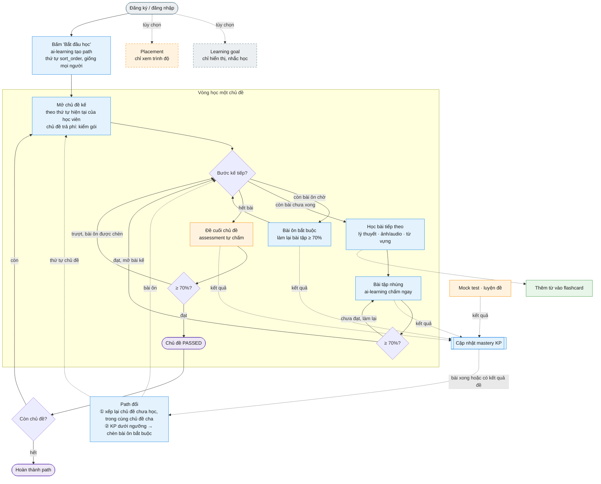

# Pipeline học chính

- Trạng thái: **thiết kế đích, chưa triển khai**. Code hiện tại (commit `2079964`) vẫn chạy theo hướng tutor DeepTutor là nơi học chính (`.sdd/specs/FEATURE_TREE_V2.md`).
- Chốt ngày 2026-09-28; cập nhật 2026-09-29: chấm theo khối, thời điểm đánh giá lại path, luật chèn bài ôn, mỗi câu chỉ gắn KP chính. Lý do và phương án đã loại: [brainstorm bài học](../reports/brainstorm-260928-2215-lesson-learning-flow-report.md). Bảng dữ liệu: [plan.md](./plan.md) mục "Bảng theo service".
- Ký hiệu: ✅ đã có code · 🆕 phải làm mới · ❓ chưa chốt.
- Quan hệ topic, KP, lesson, question: [topic-kp-lesson-question-explained.md](./topic-kp-lesson-question-explained.md).

## 1. Nguyên tắc

- Học như web luyện thi: **chủ đề → bài học**, học tuần tự, bài sau khóa đến khi xong bài trước.
- Mỗi học viên **một path**, không gắn learning goal. Path tạo khi học viên bắt đầu học.
- Ban đầu path của mọi học viên **giống nhau** (thứ tự `sort_order` do content author đặt). Sau mỗi bài hoàn thành và mỗi kết quả đề, path của từng người **khác dần**: xếp lại chủ đề chưa học và chèn bài ôn bắt buộc cho KP yếu. Path không đổi giữa lúc đang học một bài.
- Không dùng band mục tiêu, ngày thi, số phút học, placement để tạo hay xếp path. Không lọc chủ đề theo band.

## 2. Sơ đồ tổng

| Ký hiệu | Nghĩa |
| --- | --- |
| Xanh dương | ai-learning (path, mở bài, chấm bài tập, mastery) |
| Cam | assessment (placement, đề cuối, mock, luyện đề) |
| Xám | user-service |
| Xanh lá | library |
| Viền đứt | Bước tùy chọn, không ảnh hưởng path |
| Đường chấm | Kết quả chảy vào mastery rồi làm path đổi |

## 3. Các bước

### 3.1 Vào hệ thống

1. Đăng ký, đăng nhập (user-service ✅). Gateway xác thực và ký internal JWT ✅.
2. Learning goal (user-service ✅): **không bắt buộc**, không ảnh hưởng path. Bản đầu chỉ hiển thị trong hồ sơ; nhắc học và ước tính kịp ngày thi để sau.
3. Placement (assessment ✅ làm bài, 🆕 tự chấm Reading/Listening): **không bắt buộc**, không tạo path, không mở hay bỏ qua chủ đề, **không ghi vào mastery** (tắt phần ghi mastery của placement trong ai-learning 🆕).

### 3.2 Bắt đầu học → tạo path

4. App gọi `GET /api/ai-learning/topics` 🆕. Chưa có path thì ai-learning tạo 🆕: một path cho học viên, gồm mọi chủ đề đã publish, thứ tự theo `sort_order`. Không gọi LLM, không lọc band.
5. Trả danh sách chủ đề theo thứ tự hiện tại của học viên: chủ đề đầu `IN_PROGRESS`, các chủ đề sau `LOCKED`; chủ đề trả phí có nhãn premium (ai-learning hỏi access 🆕).

### 3.3 Học một bài

6. Mở bài: `GET /api/ai-learning/lessons/{id}` 🆕. ai-learning kiểm:
   - còn bài ôn bắt buộc chưa làm → 403 `REVIEW_REQUIRED` (trả kèm danh sách bài ôn);
   - bài trước chưa xong → 403 `LESSON_LOCKED`;
   - chủ đề trả phí mà chưa có gói → 403 `PREMIUM_REQUIRED`;
   - hợp lệ → lấy bài từ content (endpoint nội bộ 🆕), **bỏ `answer_spec`**, trả app.
7. Học lần lượt các block:
   - `TEXT`, `ASSET` (ảnh, audio, đoạn văn) từ content 🆕.
   - `VOCABULARY`: bấm "thêm vào flashcard" → library ✅ (flashcard nguồn `VOCABULARY_SENSE`).
   - `EXERCISE`: nộp `POST /api/ai-learning/lessons/{id}/exercises/{blockId}/submissions` 🆕 → ai-learning chấm cả khối theo `answer_spec` (bộ chấm mới 🆕) → trả đúng/sai + `explanation` từng câu, không trả `answer_spec` → ghi bằng chứng mastery cho từng cặp (câu, KP) ✅. **Nộp một khối không làm path đổi.** Khối bài tập có thể có hướng dẫn trong `text_content`.
8. Bài hoàn thành khi mỗi block bài tập có một lần nộp ≥ 70%; bài không có bài tập thì bấm "Hoàn thành" 🆕. Hoàn thành → **đánh giá lại path** (mục 3.5) → mở bài kế.

### 3.4 Đề cuối chủ đề

9. Xong mọi bài `PUBLISHED` của chủ đề → mở đề cuối (package `TOPIC_TEST` do content author soạn 🆕). Câu của đề cuối không được dùng ở bài tập của cùng chủ đề và ngược lại (content kiểm khi gắn câu 🆕).
10. Làm đề ở assessment: tạo attempt ✅ → nộp → **tự chấm** 🆕 → result `COMPLETED` → outbox → RabbitMQ `AssessmentCompleted.v2` (`TOPIC_GATE`, thêm `package_version_id` 🆕) ✅.
11. ai-learning nhận event ✅ → tra đề thuộc chủ đề nào 🆕 → cập nhật mastery ✅:
    - ≥ 70% → chủ đề `PASSED` → mở chủ đề kế **theo thứ tự hiện tại** của học viên;
    - < 70% → các KP làm sai xuống dưới ngưỡng → chèn bài ôn bắt buộc → ôn xong mới làm lại đề.
    Điểm hiện ngay khi nộp (assessment trả về); mở chủ đề kế trễ vài giây (qua event).

### 3.5 Path đổi sau mỗi kết quả

12. Mỗi lần nộp khối bài tập chỉ chấm và ghi bằng chứng mastery. Path được **đánh giá lại** 🆕 ở ba lúc: **bài vừa hoàn thành**, **nhận kết quả đề cuối**, **nhận kết quả mock hoặc luyện đề**. Mỗi lần đánh giá lại:
    - **Xếp lại chủ đề chưa bắt đầu**, chỉ giữa các chủ đề **cùng chủ đề cha**: có bằng chứng yếu lên trước → chưa có dữ liệu giữ `sort_order` → đã vững xuống cuối (vẫn phải học). Chủ đề đang học và đã `PASSED` không đổi chỗ.
    - **Chèn bài ôn bắt buộc** cho KP thỏa cả ba (kể cả KP thuộc chủ đề đã `PASSED`):
      1. mastery dưới **0.6** (một ngưỡng chung cho mọi loại KP);
      2. có câu **sai** đo KP đó trong kết quả vừa xét (các lần nộp của bài vừa xong, hoặc đề cuối, mock, luyện đề);
      3. bài dạy KP đó (qua `lesson_knowledge_points`) **đã hoàn thành** và không phải bài vừa xong. Nhiều bài thỏa thì chèn bài có `sort_order` nhỏ nhất. KP chưa có bài dạy nào đã học thì bỏ qua, vì học viên sẽ học tới.

      Điều kiện 2 cần vì engine giới hạn mastery tối đa 0.5 khi có 1 lần làm, 0.8 khi có 2 lần (`app/mastery/mastery.py`): chỉ so ngưỡng thì KP vừa làm đúng cũng bị chèn bài ôn. Mỗi KP tối đa một bài ôn đang chờ.
    - Bài ôn xong khi làm lại bài tập của bài đó ≥ 70% (mastery được cập nhật lại); bài không có bài tập thì bấm "Hoàn thành". KP chỉ bị chèn lại khi một lần đánh giá sau lại thỏa đủ ba điều kiện.
    - Bài tập nhúng chủ yếu chạm KP của chủ đề đang học, nên thứ tự chủ đề chưa học thay đổi chủ yếu nhờ mock, luyện đề, đề cuối.
    - Ôn theo lịch (spaced repetition của engine) chỉ là **gợi ý** qua `GET /review-suggestions`, không chèn bài ôn, không chặn bước kế.
13. Gắn KP cho câu hỏi: mỗi câu chỉ gắn KP mà nó thật sự đo, `weight` để 1.0. Engine không dùng `weight`: mỗi cặp (câu, KP) được tính là một lần làm đầy đủ (`compute_mastery` chỉ nhận đúng/sai).
14. Dạng câu tự chấm ở bản đầu và `answer_spec` (bảng đầy đủ ở `DATABASE_V5.md` §5.5):
    - `MULTIPLE_CHOICE` `{"correct":"A"}`; `TRUE_FALSE_NOT_GIVEN` `{"correct":"NOT_GIVEN"}`.
    - `FILL_IN_BLANK`, `SHORT_ANSWER` `{"accepted":[...]}`: không phân biệt hoa thường, bỏ khoảng trắng thừa, sai chính tả là sai.
    - `MATCHING`: mỗi câu một cặp (một đoạn ↔ một heading), heading dùng chung ở `options`, `{"correct":"iii"}`.

### 3.6 Luồng phụ (không nằm trong vòng chính)

- Mock test, luyện đề chính thức: assessment ✅ (tự chấm 🆕). Cập nhật mastery → path đổi; không mở/khóa chủ đề.
- Writing/Speaking: chấm AI (trừ điểm ở access) hoặc examiner (`examiner_profiles` 🆕); grading job hiện dừng ở `QUEUED`.
- Video YouTube, flashcard, note: library. Game, community: không đổi. Activity, streak: user-service.
- Thông báo: notification 🆕 (đề đã chấm, bài ôn mới được chèn, nhắc học).
- Tutor AI: ❓ vai trò chưa chốt, không nằm trong pipeline.

## 4. Luật

| Luật | Nội dung |
| --- | --- |
| Tạo path | Khi học viên bắt đầu học; một path mỗi học viên; không cần goal |
| Thứ tự ban đầu | `sort_order` của content, giống mọi học viên; không LLM, không lọc band |
| Chấm bài tập | Theo từng khối; mỗi lần nộp ghi bằng chứng mastery, không đổi path |
| Đánh giá lại path | Khi bài hoàn thành, khi có kết quả đề cuối, mock, luyện đề; không đổi path giữa bài |
| Xếp lại | Mỗi lần đánh giá lại; chỉ chủ đề chưa bắt đầu, chỉ giữa chủ đề cùng cha; yếu → chưa có dữ liệu → vững |
| Mở chủ đề | Chủ đề đầu tiên theo thứ tự hiện tại; chủ đề kế mở khi chủ đề trước `PASSED` |
| Mở bài | Bài 1 khi chủ đề mở; bài n khi bài n−1 xong; không còn bài ôn bắt buộc đang chờ |
| Hoàn thành bài | Mỗi block bài tập có lần nộp ≥ 70%; không có bài tập thì bấm hoàn thành; xong rồi thì giữ |
| Điểm bài | `best_score_percent` = trung bình điểm cao nhất của các khối bài tập; chỉ để hiển thị |
| Phản hồi bài tập | Đúng/sai + `explanation` từng câu; không trả `answer_spec` |
| Đề cuối | Mở khi xong mọi bài; đạt khi tổng `score / max_score` ≥ 70%; câu của đề không dùng ở bài tập cùng chủ đề |
| Bài ôn bắt buộc | Mastery < 0.6 + có câu sai trong kết quả vừa xét + bài dạy KP đã hoàn thành (không phải bài vừa xong; nhiều bài thì `sort_order` nhỏ nhất) → chèn bài đó; chặn bước kế đến khi xong |
| Ôn theo lịch | Chỉ gợi ý, không chặn |
| Bài mới trong chủ đề đã `PASSED` | Hiện `AVAILABLE`, không bắt buộc, không khóa lại chủ đề |
| Gắn KP cho câu hỏi | Chỉ KP câu thật sự đo, `weight` 1.0; engine không dùng `weight` |
| Làm lại | Không giới hạn; giữ điểm cao nhất; `requestId` trùng trả kết quả cũ |
| Premium | Theo chủ đề; danh sách vẫn hiện chủ đề trả phí, nội dung bị chặn |
| Đáp án | API học viên không bao giờ trả `answer_spec` |

## 5. Nguồn cập nhật mastery

| Nguồn | Cập nhật mastery | Làm path đổi | Mở/khóa |
| --- | --- | --- | --- |
| Bài tập nhúng (câu hỏi soạn sẵn, đã publish) | Có, mỗi lần nộp khối | Có, khi bài hoàn thành | ≥ 70% mọi khối → xong bài |
| Đề cuối chủ đề | Có | Có | ≥ 70% → chủ đề `PASSED` |
| Mock, luyện đề | Có | Có | Không |
| Placement | Không | Không | Không |
| Câu hỏi AI sinh trong tutor | Không | Không | Không |

## 6. Service tham gia

| Service | Vai trò trong pipeline |
| --- | --- |
| user | Đăng nhập; goal tùy chọn |
| content | Soạn chủ đề (`sort_order`, cha, premium, đề cuối), bài học, block, câu hỏi; endpoint nội bộ trả bài kèm `answer_spec` |
| ai-learning | Tạo và tính lại path, cổng mở bài, chấm bài tập nhúng, tiến độ, bài ôn bắt buộc, cập nhật mastery, nhận event |
| assessment | Làm và tự chấm đề cuối, mock, luyện đề, placement; phát event |
| access | Kiểm gói trả phí theo chủ đề |
| library | Từ vựng, flashcard |

## 7. Thay đổi bắt buộc so với code hiện tại

1. **Path gắn học viên thay vì goal**: `mastery_paths` và `pending_formal_assessment_results` đang theo (`user_id`, `learning_goal_id`) → migration mới trong ai-learning.
2. **Event khi không có goal**: `FinalizeAssessmentResultUseCase.java:90` không phát event nếu attempt không có goal; contract `AssessmentCompleted.v2` ghi `learning_goal_id` là **Required**. Goal tùy chọn thì học viên không goal làm đề cuối mà ai-learning không bao giờ nhận kết quả → phải nới contract (`learning_goal_id` tùy chọn) và bỏ luật "không goal thì không phát". Đổi contract cần duyệt (AGENTS §5).
3. **Tắt trong luồng tạo path**: LLM xếp thứ tự (`PathOrderer`, prompt đang có band mục tiêu, ngày thi, số phút, placement), lọc band (`CurriculumScope.select`), placement test-out.
4. **Thêm mới**: bảng bài học ở content; API học bài, bộ chấm `answer_spec`, bảng tiến độ và bài ôn ở ai-learning; tự chấm ở assessment; contract `answer_spec` + test vector dùng chung cho game, assessment, ai-learning.
5. **Sửa trước khi dùng**: endpoint entitlement của access đang không có guard.
6. **Cập nhật spec**: `FEATURE_TREE_V2.md` còn mô tả tutor là nơi học chính.

## 8. Câu hỏi mở

Đã chốt ngày 2026-09-29 (ghi ở các mục trên): ngưỡng 0.6, câu đề cuối không dùng ở bài tập, chọn bài ôn theo `sort_order`, placement không ghi mastery, ôn theo lịch chỉ gợi ý, bài mới trong chủ đề đã `PASSED`, goal chỉ hiển thị, dạng câu và `answer_spec`, phản hồi bài tập, điểm bài, hướng dẫn khối bài tập.

Còn mở:

- Vai trò tutor trong bài học (hỏi đáp về bài đang học?). Vòng này không đổi tutor.
- Nhắc học theo số phút và ước tính kịp ngày thi từ goal: để sau bản đầu, phụ thuộc notification-service.
