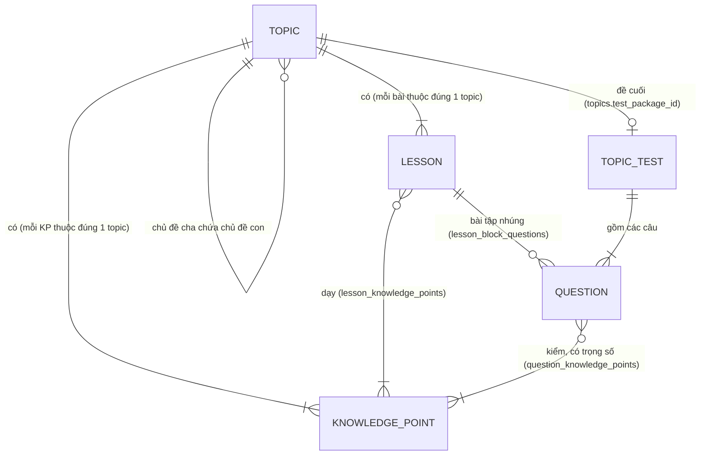

# Topic, KP, Lesson, Question: chúng liên quan với nhau thế nào

Giải thích cho [main-learning-pipeline.md](./main-learning-pipeline.md). Bảng `topics`, `knowledge_points`, `questions`, `question_knowledge_points` đã có trong content (✅); `lessons`, `lesson_knowledge_points`, `lesson_block_questions` là bảng mới trong thiết kế đích (🆕).

## 1. Hiểu nhanh bằng một cuốn sách luyện thi

| Trong sách | Trong hệ thống | Học viên làm gì với nó |
| --- | --- | --- |
| Chương "Tìm ý chính" | **Topic** (chủ đề) | Mở ra, đi qua, được tính là đạt |
| Mục tiêu đầu chương: "Sau chương này bạn sẽ tìm được câu chủ đề" | **KP** (knowledge point) | Không mở được; hệ thống **đo** học viên đã nắm tới đâu |
| Các trang giảng trong chương | **Lesson** (bài học) | Đọc, xem, học |
| Câu bài tập, câu trong đề | **Question** (câu hỏi) | Trả lời; mỗi câu là một phép đo cho một hoặc vài KP |

Một câu để nhớ:

> **Topic và Lesson là thứ học viên đi qua. KP là thứ hệ thống đo. Question là cây thước để đo KP.**

## 2. Một ví dụ đầy đủ

**Topic T1 "Tìm ý chính"**, nằm trong chủ đề cha **Reading**. T1 có 2 KP:

| KP | Tên | Nghĩa |
| --- | --- | --- |
| KP-A | Xác định câu chủ đề | Biết câu nào là câu chủ đề của đoạn |
| KP-B | Phân biệt ý chính và chi tiết | Biết một câu là ý chính hay chỉ là chi tiết minh họa |

**2 bài học** trong T1, mỗi bài dạy một KP:

| Bài | Dạy KP | Nội dung |
| --- | --- | --- |
| L1 "Câu chủ đề nằm ở đâu" | KP-A | Lý thuyết, đoạn văn mẫu về cây xanh đô thị, từ vựng, bài tập Q1 |
| L2 "Ý chính hay chi tiết?" | KP-B | Lý thuyết, ví dụ, bài tập Q3 |

**3 câu hỏi** trong ngân hàng câu hỏi, mỗi câu được gắn với KP mà nó kiểm:

| Câu | Nội dung | Kiểm KP (trọng số) | Được dùng ở |
| --- | --- | --- | --- |
| Q1 | "Câu nào là câu chủ đề của đoạn 2?" | KP-A (1.0) | Bài tập L1, đề cuối T1 |
| Q2 | "What is the passage mainly about?" (câu seed có sẵn) | KP-A (1.0) | Đề cuối T1, mock test |
| Q3 | "'Cây giảm nhiệt độ thành phố 2°C' là ý chính hay chi tiết?" | KP-B (1.0) | Bài tập L2, đề cuối T1 |

Mỗi câu chỉ gắn KP mà nó thật sự đo, `weight` để 1.0. Engine mastery không dùng `weight`: một câu gắn hai KP thì mỗi KP được tính như một lần làm đầy đủ, nên gắn thêm KP phụ sẽ làm mastery KP đó lệch.

## 3. Sơ đồ quan hệ



Đọc sơ đồ theo từng mũi tên:

| Quan hệ | Số lượng | Bảng | Ví dụ |
| --- | --- | --- | --- |
| Topic cha → topic con | 1 cha, nhiều con | `topics.parent_topic_id` ✅ | Reading chứa T1, T2 |
| Topic → KP | 1 topic, nhiều KP; **mỗi KP thuộc đúng 1 topic** | `knowledge_points.topic_id` ✅ | T1 có KP-A, KP-B |
| Topic → Lesson | 1 topic, nhiều bài; mỗi bài thuộc đúng 1 topic | `lessons.topic_id` 🆕 | T1 có L1, L2 |
| Lesson ↔ KP | nhiều – nhiều | `lesson_knowledge_points` 🆕 | L1 dạy KP-A |
| Question ↔ KP | nhiều – nhiều (một câu nên gắn KP chính) | `question_knowledge_points` ✅ | Q3 kiểm KP-B |
| Lesson → Question | 1 bài, nhiều câu bài tập | `lesson_block_questions` 🆕 | L1 dùng Q1 |
| Topic → đề cuối | 1 topic, 1 đề | `topics.test_package_id` 🆕 | Đề cuối T1 gồm Q1, Q2, Q3 và 7 câu khác |

## 4. Điều dễ nhầm nhất: câu hỏi không thuộc topic

Bảng `questions` **không có cột `topic_id`**. Câu hỏi chỉ liên quan tới topic **qua KP**:

```text
Q3 ──kiểm──► KP-B ──thuộc──► T1
```

Vì vậy:

- Câu hỏi nằm trong một **ngân hàng dùng chung**, không nằm trong chương nào. Cùng một câu có thể xuất hiện trong bài tập, trong đề cuối và trong mock test.
- Một câu có thể kiểm KP của **nhiều topic**. Ví dụ một câu mock test kiểm KP-A (thuộc T1) và KP-C (thuộc T2). Làm câu đó xong, mastery của cả T1 và T2 đều thay đổi.
- Câu hỏi đã có sẵn dạng: `MULTIPLE_CHOICE`, `FILL_IN_BLANK`, `MATCHING`, `TRUE_FALSE_NOT_GIVEN`, `SHORT_ANSWER`, `ESSAY`, `SPEAKING`. Bài tập nhúng chỉ dùng các dạng tự chấm được, không dùng `ESSAY` và `SPEAKING`.

## 5. Một câu trả lời đi qua các bảng thế nào

Lan đã xong L1, L2 và làm đề cuối T1, **sai Q3**:

```text
① Lan sai Q3 trong đề cuối (assessment chấm, gửi event cho ai-learning)
      │  question_knowledge_points: Q3 → KP-B
      ▼
② Ghi bằng chứng: mastery KP-B của Lan giảm (lưu ở ai-learning, theo từng học viên)
      │  Có kết quả đề → đánh giá lại path
      │  KP-B dưới ngưỡng + có câu sai (Q3) + bài dạy KP-B đã hoàn thành?
      │  lesson_knowledge_points: KP-B ← L2
      ▼
③ L2 đã hoàn thành → chèn L2 làm bài ôn bắt buộc
      │
      ▼
④ Độ yếu của T1 = mastery trung bình của KP-A và KP-B
   → dùng để xếp thứ tự các topic chưa học (chỉ trong cùng topic cha)
```

Nếu Lan sai Q3 khi đang làm bài tập của L2, path **không** đổi ngay: nộp một khối bài tập chỉ ghi bằng chứng. Path chỉ được đánh giá lại khi L2 hoàn thành, và khi đó L2 là bài vừa xong nên không bị chèn làm bài ôn.

## 6. Ba thước đo khác nhau, đừng lẫn

| Thước đo | Đo cái gì | Tính từ đâu | Dùng để |
| --- | --- | --- | --- |
| **Bài hoàn thành** | Lan đã học xong L1 chưa | Bài tập nhúng của L1 ≥ 70% | Mở bài kế tiếp |
| **Topic đạt** | Lan đã qua T1 chưa | Đề cuối T1 ≥ 70% | Mở topic kế tiếp |
| **Mastery KP** | Lan nắm KP-B tới đâu (0 → 1) | Mọi câu trả lời có kiểm KP-B, ở bất kỳ đâu | Chèn bài ôn, xếp lại thứ tự topic |

Ba thước đo này có thể lệch nhau, và điều đó là bình thường. Ví dụ Lan **đạt T1** (80% đề cuối) nhưng **KP-B vẫn yếu** vì 2 câu sai đều là KP-B. T1 vẫn tính là đạt, nhưng L2 sẽ bị chèn thành bài ôn.

## 7. Luật để dữ liệu không rối

| Luật | Trạng thái |
| --- | --- |
| Mỗi KP thuộc đúng 1 topic | ✅ DB bắt buộc (`topic_id NOT NULL`) |
| Mỗi lesson thuộc đúng 1 topic | 🆕 DB bắt buộc (`lessons.topic_id NOT NULL`) |
| Lesson chỉ gắn KP **cùng topic** với nó | 🆕 Đề xuất, kiểm ở use case khi content author gắn KP (DB không tự kiểm được) |
| Mỗi KP của topic nên có ít nhất 1 lesson dạy nó | 🆕 Đề xuất; không có thì KP yếu sẽ không có bài ôn để chèn |
| Mỗi câu hỏi gắn ít nhất 1 KP | 🆕 Đề xuất; câu không gắn KP thì không đo được gì |
| Câu hỏi dùng trong bài tập nhúng phải tự chấm được | 🆕 Theo quyết định "chỉ dạng tự chấm" |

## 8. Hỏi nhanh

**Học viên có nhìn thấy KP không?**
Có thể hiển thị như "mục tiêu của chủ đề" kèm thanh mastery. Nhưng học viên không mở và học KP như mở bài; họ học bài, còn KP là thứ được đo.

**Tại sao không đo theo topic cho đơn giản?**
Quá thô. Đạt 80% đề cuối không cho biết 20% sai nằm ở đâu. KP chỉ ra đúng chỗ hổng để chèn đúng bài ôn.

**Tại sao không bỏ topic, chỉ dùng KP?**
Học viên cần "chương" để đi theo từng bước và để mở khóa. KP quá vụn (một topic có thể có 5–10 KP), không hợp làm đơn vị học.

**Một câu hỏi sửa nội dung thì bài tập cũ có đổi theo không?**
Không. Bài tập và đề ghim đúng một phiên bản câu hỏi (`question_version_id`). Sửa câu hỏi sẽ tạo phiên bản mới, và content author chủ động cập nhật chỗ dùng nó.
